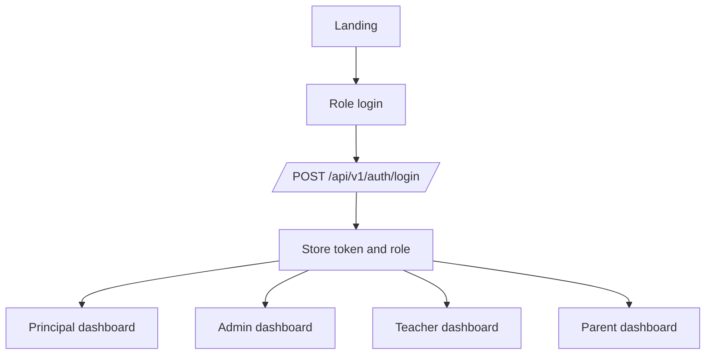
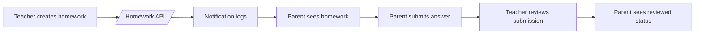
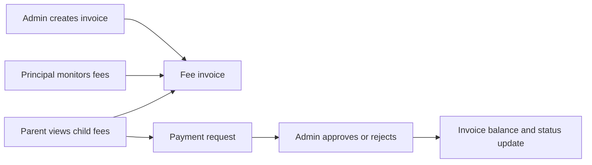

# SchoolDesk Product Requirements

## Product Summary

SchoolDesk is a production school ERP for principals, admins, teachers, and parents. The application must show only backend-backed data from the Go `/api/v1` service, enforce role-based access, and provide compact operational screens that work on Android phones, tablets, landscape layouts, and web builds.

The product is not a demo shell. Screens must avoid mock rows, local-only mutations, hidden fallback workflows, and hardcoded credentials. Empty states are allowed only when they honestly represent an empty backend response.

## Production Goals

- Provide one authenticated operational workspace per role.
- Keep every retained module backed by live REST APIs, typed client adapters, and RBAC checks.
- Make role workflows understandable from the UI, source layout, and this PRD/SPEC pair.
- Keep the codebase source-only: no historical screenshots, local database files, binary builds, ad hoc reports, or duplicate documentation.
- Use a modular Flutter architecture so each feature owns its data, domain, state, and presentation code.
- Keep backend route ownership modular by domain while preserving existing `/api/v1` contracts.

## Roles And Responsibilities

| Role | Primary user | Responsibilities | Product promise |
| --- | --- | --- | --- |
| Principal | School leadership | Governance, approvals, academic supervision, class/subject oversight, reports, fees monitoring, school profile, operational inbox | Full-school command center with cross-module visibility and final approval authority |
| Admin | Operations staff | Students, staff, attendance operations, fee operations, timetable, exams, documents, helpdesk, account access, communication | Daily operations cockpit with creation/update workflows and controlled records access |
| Teacher | Teaching staff | Assigned classes, student attendance, homework, communication, parent interaction, leave, discipline, reports, diary | Class-first workspace scoped to assigned staff identity and timetable |
| Parent | Guardian | Child dashboard, attendance, homework, notices, chat, fees, leave requests, calendar, documents, diary | Family portal scoped only to linked children and parent-owned actions |
| Public | Unauthenticated visitor | Landing and onboarding/sign-in | Clean path into authentication without exposing protected data |

## Public And Shared Screens

| Screen | Route | Purpose | Backend contract |
| --- | --- | --- | --- |
| Landing | `/`, `/landing-page-screen` | Public entry point and role selection | No protected API required |
| Onboarding | `/onboarding-screen` | First-run school setup and sign-in path | Uses school setup/auth endpoints only |
| Auth login | role login routes | Username/password sign-in for all roles | `/api/v1/auth/login`, token storage, role restore |
| Notification Center | `/notification-center-screen` | Shared notification list and read state | `/api/v1/notifications` |
| Settings | `/settings-screen` | App display and account preferences | Local settings plus profile context |
| Profile | `/profile-screen` | Shared user profile and avatar updates | `/api/v1/auth/profile`, avatar upload |
| Global Search | `/global-search-screen` | Role-safe navigation/search surface | Backend-backed searchable records where available |

## Principal Workspace

| Screen | Route | Requirement |
| --- | --- | --- |
| Principal Dashboard | `/principal-dashboard-screen` | Show leadership KPIs, alerts, and module entry points from backend dashboard data. |
| Guided Assistant | `/guided-assistant-screen` | Guide admin/principal workflow sessions without local fake templates. |
| School Profile | `/principal-school-profile-screen` | View/edit school details and logo through backend school endpoints. |
| Access Permissions | `/principal-user-management-screen` | Manage staff/admin/parent accounts, linked records, and approvals. |
| Parents and Guardians | `/guardian-directory-screen` | Show parent accounts, guardian records, and child links. |
| Class Hub | `/principal-classes-screen` | Supervise grades, sections, class teachers, student counts, and class instructions. |
| Attendance | `/principal-attendance-screen` | Monitor attendance summaries and class/session records. |
| Subjects | `/principal-subjects-screen` | Review subject coverage, mappings, and academic actions. |
| Timetable Records | `/principal-timetable-screen` | Review timetable slots, substitutions, suggestions, and principal advice. |
| Exam Records | `/principal-exams-screen` | Review exam setup, schedules, and exam actions. |
| Results | `/principal-results-screen` | Track result/report workflows. |
| Staff Oversight | `/staff-management-screen` | Principal-owned staff list, forms, profile photo upload, and backend mutations. |
| Student Oversight | `/student-oversight-screen` | Student list, details, parent links, summaries, and removal actions. |
| Approval Center | `/approval-center-screen` | Student leave, account, class, and operational approval decisions. |
| Operational Inbox | `/principal-inbox-screen` | Principal communication and workflow inbox. |
| Fee Monitoring | `/fee-monitoring-screen` | View fee structures, invoices, payments, concessions, and class/student visibility. |
| Academic Management | `/academic-management-screen` | Shared principal/admin academic year, subject, class, and curriculum management. |
| Communication Center | `/communication-center-screen` | Notices, circulars, and school communication. |
| Complaints | `/complaint-management-screen` | Backend-backed tickets and complaint updates. |
| Calendar | `/events-calendar-screen` | Events, holidays, exams, and PTM context. |
| Reports | `/reports-analytics-screen` | Export lifecycle, report cards, analytics, and download status. |
| Analytics | `/principal-analytics-screen` | Backend-derived leadership analytics without demo rows. |

## Admin Workspace

| Screen | Route | Requirement |
| --- | --- | --- |
| Admin Dashboard | `/admin-dashboard-screen` | Operations KPIs, records health, and owned module entry points. |
| Students | `/admin-students-screen` | Student directory and backend-backed student operations. |
| Staff | `/admin-teachers-screen` | Admin-owned staff management through shared staff feature. |
| Attendance | `/admin-attendance-screen` | Attendance records, exports, and class filters from backend data. |
| Fees | `/admin-fees-screen` | Fee structures, invoices, payments, payment requests, concessions, reports. |
| Timetable | `/admin-timetable-screen` | Generate timetable, manage periods, substitutions, and teacher slot ownership. |
| Exams | `/admin-exams-screen` | Exam setup, schedules, publishing, marks, and report cards. |
| Communication | `/admin-communication-screen` | Notice management with audience/status filters. |
| Helpdesk | `/admin-helpdesk-screen` | Operational tickets and support records. |
| Documents | `/admin-documents-screen` | Records and uploaded document handling. |
| Access | `/admin-user-access-screen` | Teacher and parent accounts, child assignment, status management. |
| Reports | `/admin-reports-screen` | Admin report exports and operational analytics. |
| Academic Info | `/admin-academic-info-screen` | Shared school academic info. |

## Teacher Workspace

| Screen | Route | Requirement |
| --- | --- | --- |
| Teacher Dashboard | `/teacher-dashboard-screen` | Assigned class, today timetable, homework, notices, and actions. |
| My Classes | `/teacher-classes-screen` | Assigned classes from staff scope and timetable links. |
| Student Attendance | `/teacher-attendance-screen` | Mark attendance only for assigned staff timetable slots and enrollments. |
| My Attendance | `/teacher-my-attendance-screen` | Staff attendance summary for the signed-in teacher. |
| Homework | `/teacher-homework-screen` | Create, update, delete, and review homework using backend homework APIs. |
| Homework Form | `/teacher-homework-screen/form` | Routed creation/editing form with assigned classes and students. |
| Homework Submissions | `/teacher-homework-screen/submissions` | Review parent/student submissions and feedback. |
| Performance | `/teacher-performance-screen` | Student progress and academic performance context. |
| Student Notes | `/teacher-student-notes-screen` | Teacher-owned notes and academic observations. |
| Communication | `/teacher-communication-screen` | Chat-first conversations and school notices. |
| Parent Interaction | `/teacher-parent-interaction-screen` | Parent meetings and teacher-parent communication. |
| Leave | `/teacher-leave-screen` | Teacher leave history and request state. |
| Discipline | `/teacher-discipline-screen` | Incidents and discipline records. |
| Reports | `/teacher-reports-screen` | Teacher export and report context. |
| Class Diary | `/teacher-diary-screen` | Class diary entries and shared parent visibility. |

## Parent Workspace

| Screen | Route | Requirement |
| --- | --- | --- |
| Parent Dashboard | `/parent-dashboard-screen` | Child summaries, fees, attendance, homework, notices, and calendar. |
| Academic Progress | `/parent-academic-progress-screen` | Marks, report cards, progress snapshots for linked children only. |
| Attendance | `/parent-attendance-screen` | Child attendance timeline and summaries. |
| Homework | `/parent-homework-screen` | Assigned homework, submission state, and teacher feedback. |
| Submit Homework | `/parent-homework-screen/submit` | Routed submission workflow. |
| Notices | `/parent-notices-screen` | Parent-visible announcements and notices. |
| Teacher Chat | `/parent-teacher-chat-screen` | Conversations scoped to linked children and teachers. |
| Fees | `/parent-fees-screen` | Invoices, payment history, payment requests, and receipt preview. |
| Leave | `/parent-leave-screen` | Parent-created student leave requests and status. |
| Calendar | `/parent-calendar-screen` | Events, holidays, exams, and PTM schedule. |
| Documents | `/parent-documents-screen` | Parent-visible documents. |
| Class Diary | `/parent-diary-screen` | Teacher diary updates for linked children. |

## UX Requirements

- First screen after login must be the operational dashboard for the restored role.
- Navigation must be role-scoped and avoid disabled/unfinished modules.
- Tables, lists, chips, and form actions must not overflow on small Android phones.
- Text scaling must be supported up to the app-defined maximum instead of forcing `1.0`.
- Icons, tooltips, and semantic labels must be present for action-heavy screens.
- Loading, empty, error, and success states must be explicit.
- Forms must use routed full-screen surfaces when the workflow is complex or needs context persistence.
- Backend failures must be visible and recoverable; no silent fallback to stale local data.

## Backend Truth Requirements

- All protected screens require authenticated `/api/v1` access.
- Current role and school scope are derived from token/session state.
- Principal sees school-wide supervision; admin sees operations; teacher sees assigned staff scope; parent sees linked children only.
- Fee data must align across class-wise, student-wise, admin, principal, and parent surfaces.
- Homework lifecycle must connect teacher creation, parent submission, teacher review, and notifications.
- Attendance must connect timetable slots, enrollments, sessions, and role-specific summaries.
- Report exports must create backend jobs/artifacts and expose status/download state.

## Core Workflows

## Non Goals

- No student portal route in the current release.
- No transport or library route exposure in the current release.
- No local-only demo dashboards.
- No generated build outputs, screenshots, local databases, or historical QA evidence in source control.

## Acceptance Criteria

- Only `README.md`, `docs/PRD.md`, and `docs/SPEC.md` remain as markdown documentation.
- `flutter analyze`, `flutter test --no-pub`, and `go test ./...` pass.
- Android smoke verifies login/dashboard/navigation for principal, admin, teacher, and parent.
- Active screens are documented above and backed by route metadata and tests.
- Retired files and artifacts are deleted instead of archived.
