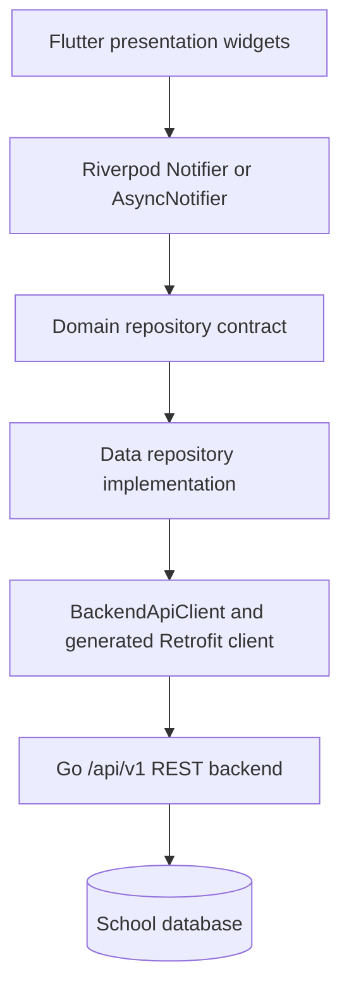
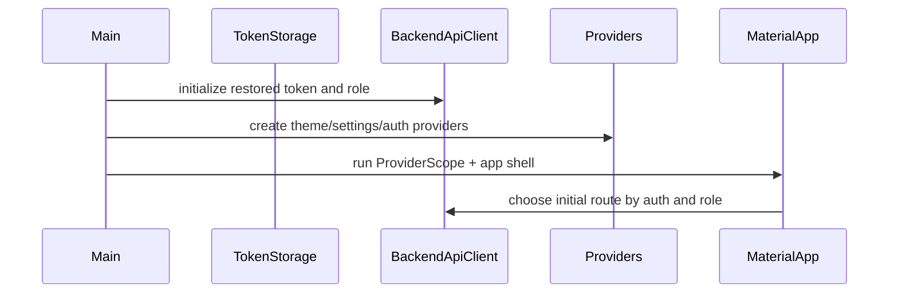
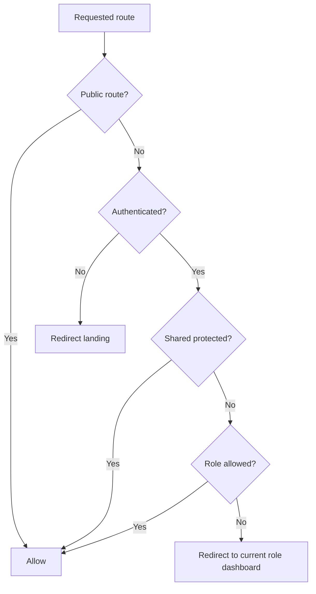
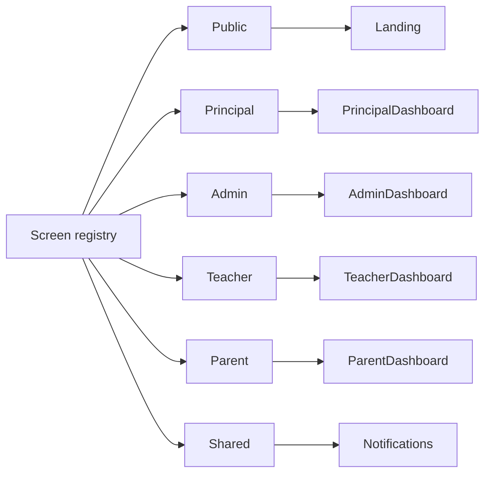
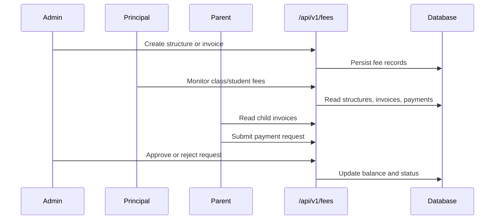
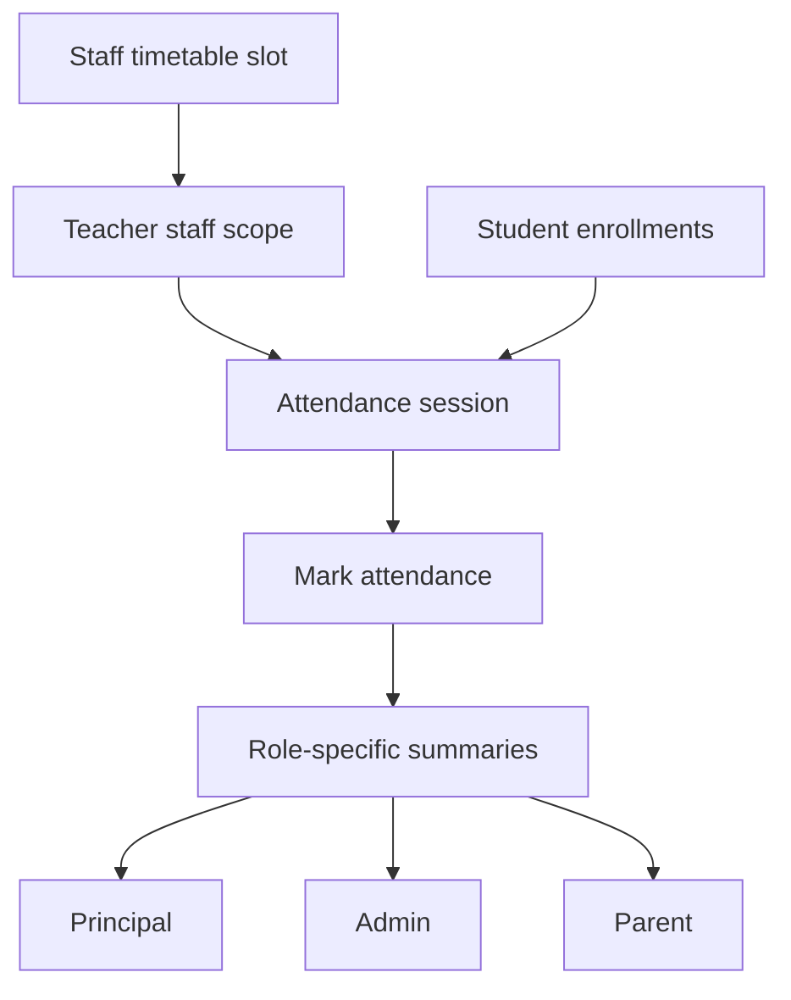
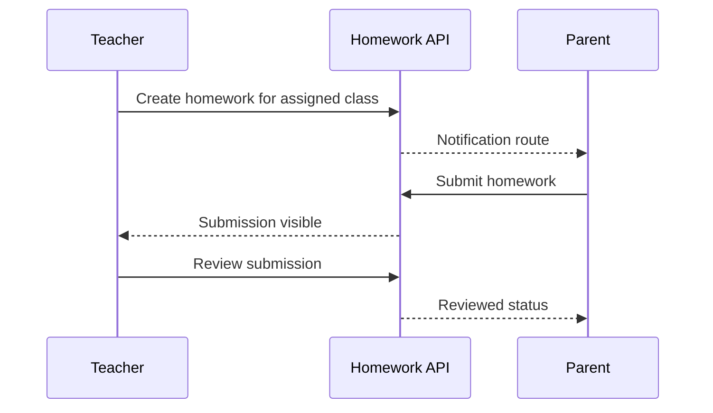
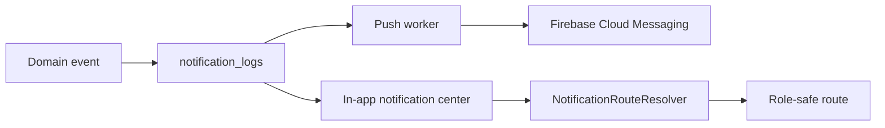
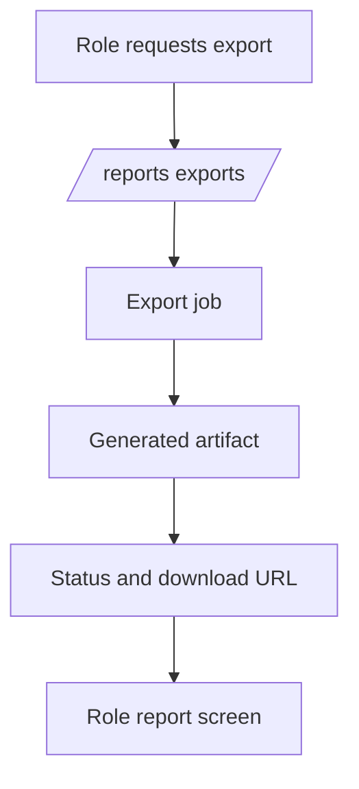

# SchoolDesk Technical Specification

## Architecture Overview

SchoolDesk uses a Flutter client and a Go REST backend. The target client architecture is feature-first with strict boundaries:

- `lib/app`: app bootstrap, root providers, and MaterialApp shell.
- `lib/core`: config, network facade, local services, theme, shared widgets, errors, constants, and utilities.
- `lib/features/<domain>/data`: API adapters, DTO mappers, and repository implementations.
- `lib/features/<domain>/domain`: typed entities, repository contracts, and reusable use cases.
- `lib/features/<domain>/presentation`: screens, controllers, widgets, and Riverpod state.
- `lib/core/network/schooldesk_api.dart`: hand-written runtime singleton for Dio, token refresh, and generated Retrofit client setup.
- `lib/core/network/generated`: generated Retrofit/Freezed API infrastructure. These files are retained and regenerated, never manually edited.
- `lib/core/network/api_modules`: hand-written API facade modules split by backend domain.
- `school-backend/internal/routes`: domain route registration for `/api/v1`.
- `school-backend/internal/handlers`: domain handlers and request/response logic.
- `school-backend/internal/database`: schema creation, migrations, and persistence constraints.



## Flutter Runtime

The app starts in `main.dart`, initializes backend/session services, validates environment configuration, registers push notification support, and runs the widget tree under Riverpod `ProviderScope`. Existing Provider-based theme and settings notifiers are retained during migration and wrapped inside the Riverpod root.



## Route And RBAC Contract

Route access is controlled by `RouteAccessGuard`. Public routes require no token. Shared protected routes require authentication. Role routes require a matching normalized role.

| Route group | Allowed roles |
| --- | --- |
| Public landing/onboarding/login | Unauthenticated |
| Principal routes | Principal |
| Admin routes | Admin |
| Teacher routes | Teacher |
| Parent routes | Parent |
| Shared protected routes | Any authenticated role |



## API Client Contract

`BackendApiClient` is the stable facade consumed by repositories and legacy screens during migration. It may delegate to:

- generated Retrofit client for migrated roots;
- API modules under `lib/core/network/api_modules`;
- typed backend models under `lib/features/shared/data/models`.

Presentation code must not import Dio directly. New or migrated screens must not parse arbitrary `Map<String, dynamic>` payloads in widgets; parsing belongs in data adapters.

## Domain Modules

| Domain | Flutter package target | Backend route/handler ownership |
| --- | --- | --- |
| Auth | `features/auth` | `/auth`, auth handler, token/session middleware |
| Shell/navigation | `features/shell` | route metadata, role redirects, notifications navigation |
| Dashboard | `features/dashboard` | role dashboard summaries |
| People | `features/people` | staff, students, guardians, parent links, users |
| Academics | `features/academics` | academic years, grades, sections, subjects, classes, curriculum |
| Attendance | `features/attendance` | sessions, mark attendance, summaries |
| Calendar | `features/calendar` | events, holidays, PTM, exam milestones |
| Documents | `features/documents` | school and parent-facing documents, ID cards |
| Finance | `features/finance` | fee structures, invoices, payments, payment requests |
| Communication | `features/communication` | notices, messages, complaints, PTM, device tokens |
| Homework | `features/homework` | homework assignments, submissions, review |
| Leave | `features/leave` | teacher leave and student leave requests |
| Operations | `features/operations` | helpdesk and operational workflows |
| Reports | `features/reports` | report exports, analytics, report cards |
| Profile/settings | `features/profile` | profile, avatar, school profile, settings |

## Retained Screen Registry

The retained screens are exactly the active public, shared, principal, admin, teacher, and parent screens listed in `PRD.md`. Inactive screens are deleted if they are not referenced by route metadata, navigation, or tests.



## Data Flow Diagrams

### Fees



### Attendance



### Homework



### Notifications



### Reports



### Backend Runtime

```mermaid
flowchart TD
  Gin[Gin engine] --> Operational[Operational routes]
  Gin --> V1[/api/v1 routes]
  V1 --> Auth[Auth middleware]
  Auth --> SchoolScope[School scope middleware]
  SchoolScope --> RBAC[RBAC middleware]
  RBAC --> Handler[Domain handler]
  Handler --> DB[(Database)]
  Handler --> Queue[Redis-backed queue when enabled]
```

## Backend Route Modules

Route registration is owned by the `routes` package. `main.go` must only set up runtime dependencies and call route registrars. Domain registrars should group related endpoints and keep handler setup near route setup.

Required route domains:

- auth and profile;
- dashboard;
- principal command center;
- assistant workflows;
- school setup and academic setup;
- people and account access;
- attendance;
- timetable;
- finance;
- exams and reports;
- communication and notifications;
- homework and leave;
- generic active ERP resources.

## Source-Only Cleanup Policy

Allowed documentation files:

- `README.md`
- `docs/PRD.md`
- `docs/SPEC.md`

Disallowed source-control clutter:

- local databases;
- compiled backend binaries;
- Flutter/Gradle build outputs;
- test result JSON/HTML;
- screenshots and UI evidence folders;
- preview HTML;
- doc reference image archives;
- old plan/audit/runbook markdown files;
- zip exports.

## Dependency Policy

Keep direct dependencies only when imported by source or required by build/codegen. Generated Retrofit/Freezed outputs stay because they are active API infrastructure. Provider stays temporarily for theme/settings compatibility; Riverpod is the target state layer for new and migrated features.

## Verification Contract

Every cleanup/refactor wave must pass:

```bash
flutter analyze
flutter test --no-pub
go test ./...
```

Final production confidence additionally requires Android smoke verification for:

- principal login, dashboard, navigation, and one governance/academic workflow;
- admin login, dashboard, navigation, and one operations workflow;
- teacher login, dashboard, navigation, and one classroom workflow;
- parent login, dashboard, navigation, and one child-facing workflow.
