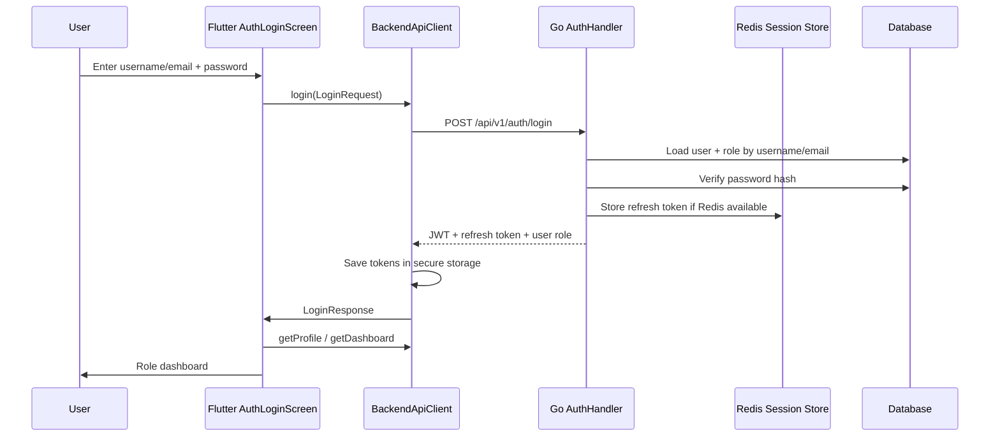
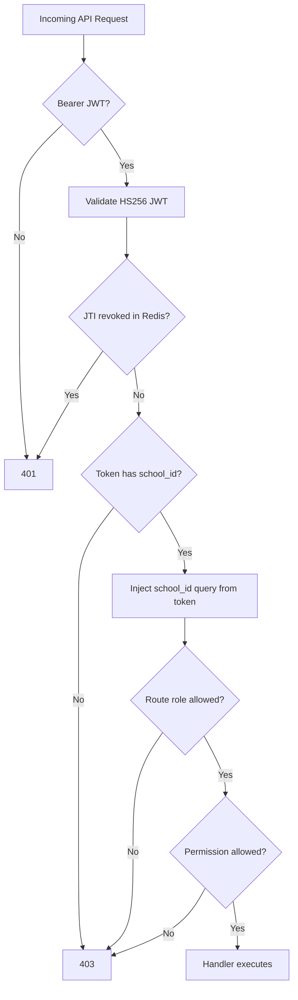
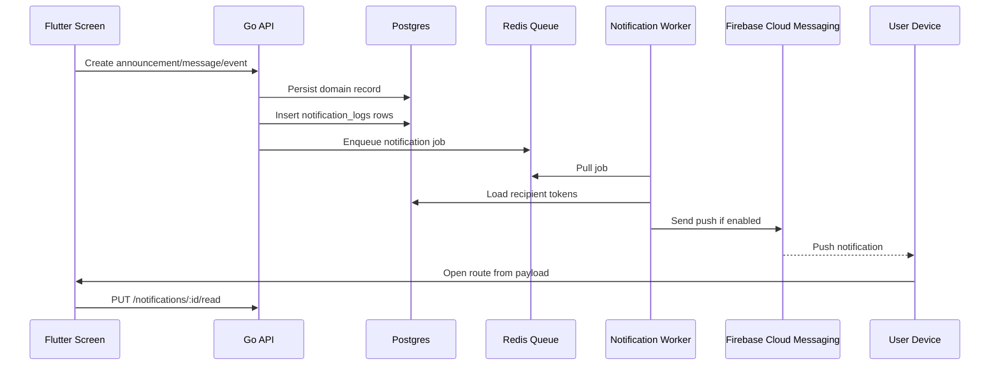
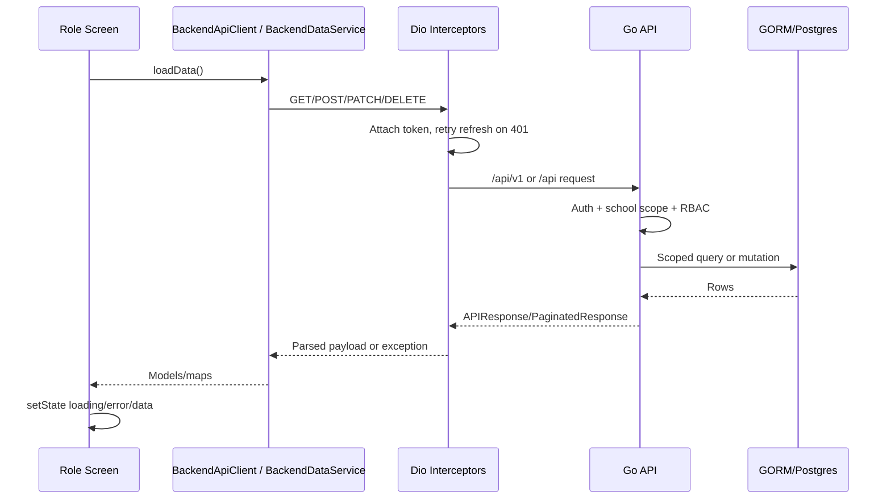
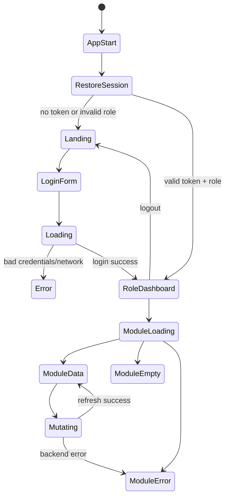
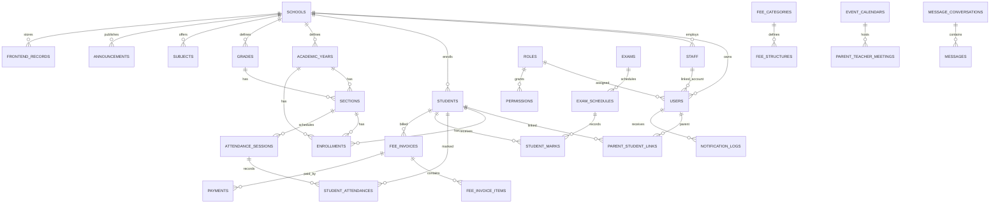
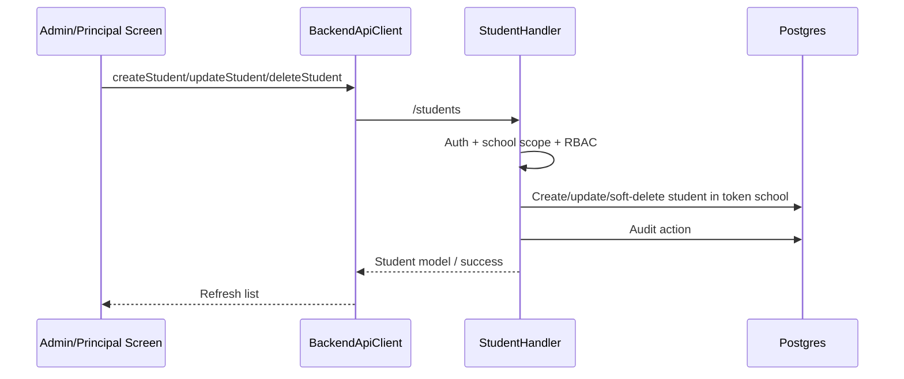
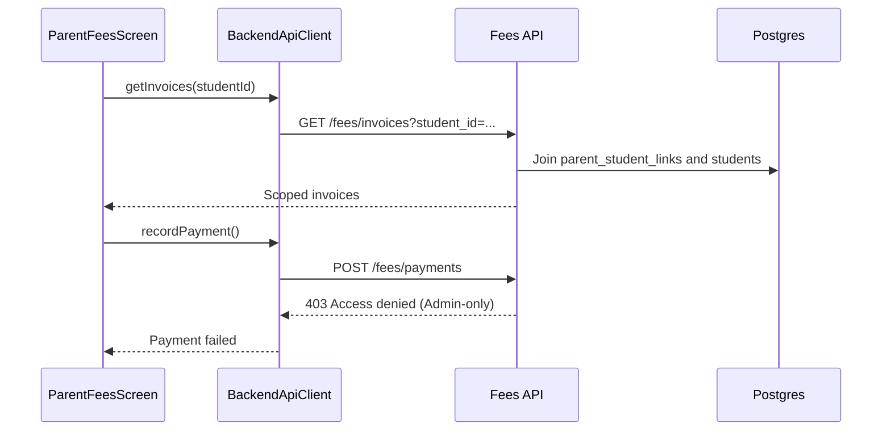

# SchoolDesk Production Architecture And Integration Audit

Date: 2026-05-15  
Scope: Flutter app in `lib/`, Go/Gin backend in `school-backend/`, Docker/env/deployment files, tests, route registry, API clients, feature availability flags, and existing docs.  
Audit type: code-level production architecture and frontend/backend integration audit. No live deployed database or physical-device session was used in this pass.

## Executive Summary

SchoolDesk V1 is no longer a demo-only Flutter app. Most core school ERP paths are wired to a Go/Gin backend through `BackendApiClient`, JWT auth, role routes, Postgres/GORM models, Redis-backed session/rate/cache services, audit logs, notifications, and a broad route/RBAC tree.

The project is not production-complete yet. The current system is best described as a strong production candidate with several partial modules and a few workflow-breaking mismatches. The highest-risk gaps are parent fee payment, parent student leave, parent calendar, report/export workflows, duplicate API layers, and several hand-written backend handlers that bypass consistent school-scoped query patterns.

Production readiness score: **72 / 100**

Score breakdown:

| Area | Score | Notes |
|---|---:|---|
| Core auth and role routing | 82 | JWT, route guard, role dashboards, profile restore, RBAC middleware are present. |
| Frontend/backend feature integration | 74 | Most core screens use backend, but parent leave/calendar/payments/reports have mismatches or static shells. |
| Backend multi-tenant security | 70 | Good middleware, but several custom detail/update/list handlers need school-scope fixes. |
| Data model and API architecture | 68 | Rich domain schema exists, but generic `frontend_records` and compatibility tables create drift. |
| DevOps/deployment readiness | 72 | Docker, Postgres, Redis, env validation, production config checks exist; no CI workflow found. |
| Observability and monitoring | 55 | Request IDs/audit logs exist; crash reporting/APM/centralized logs/analytics are not production-grade yet. |
| Test coverage | 80 | `go test ./...`, `flutter analyze`, and `flutter test` pass; integration tests require device/web support and QA env. |

## Verification Run

| Check | Result | Evidence |
|---|---|---|
| Backend tests | PASS | `cd school-backend && go test ./...` passed, including `school-backend/tests`. |
| Flutter static analysis | PASS | `flutter analyze` returned `No issues found`. |
| Flutter unit/widget suite | PASS | `flutter test` passed 201 tests. |
| Targeted frontend/backend truth tests | PASS | Route guard, backend target switching, and staff backend wiring tests passed. |
| Flutter integration tests | NOT RUN | `flutter test integration_test` failed immediately: `Web devices are not supported for integration tests yet.` Role smoke tests also require QA credentials. |

## Current Architecture

### Active Backend Reality

The active backend is **Go/Gin + GORM + Postgres/SQLite + Redis**. Firebase is only used for Firebase Cloud Messaging client/server push support when configured.

| Requested Firebase Area | Current Project Reality |
|---|---|
| Authentication | Go backend JWT auth via `/api/v1/auth/*` and compat `/api/auth/*`. No Firebase Auth in active path. |
| Realtime Database / Firestore | No active Firestore or Realtime Database CRUD usage found in Flutter app/backend. |
| Cloud Functions | No active Cloud Functions implementation. Backend triggers are Go handlers/workers. |
| Storage | Local backend upload serving through `/uploads`; no active Firebase Storage access rules. |
| Analytics | `EnvConfig.enableAnalytics` exists, but no full analytics pipeline is wired. |
| Security Rules | No Firebase rules apply. Security is middleware/RBAC/school-scope plus database constraints. |
| Indexes | Postgres relationship/index migration exists behind `ENABLE_RELATIONSHIP_CONSTRAINTS`; GORM automigration disables FK creation by default. |

## System Architecture

```mermaid
flowchart TD
  User[Principal/Admin/Teacher/Parent] --> Flutter[Flutter MaterialApp]
  Flutter --> RouteGuard[RouteAccessGuard]
  RouteGuard --> Screens[Role Screens And Widgets]
  Screens --> BackendApiClient[BackendApiClient /api/v1]
  Screens --> BackendDataService[BackendDataService raw/generic adapter]
  Screens --> LegacyApiService[Legacy ApiService /api]

  BackendApiClient --> GoAPI[Go Gin API]
  BackendDataService --> GoAPI
  LegacyApiService --> CompatAPI[Compat /api routes]
  CompatAPI --> GoAPI

  GoAPI --> AuthMW[AuthMiddleware]
  AuthMW --> SchoolScope[SchoolScopeMiddleware]
  SchoolScope --> RBAC[RBAC + PermissionMiddleware]
  RBAC --> Handlers[Domain Handlers]
  Handlers --> GORM[GORM Models]
  GORM --> Postgres[(Postgres)]
  GORM --> SQLite[(SQLite dev/tests)]

  GoAPI --> Redis[(Redis)]
  Redis --> Sessions[Refresh Tokens / Revoked JTIs]
  Redis --> RateLimit[Rate Limits]
  Redis --> Cache[Dashboard Cache]
  Redis --> Queue[Notification Queue]

  Queue --> Worker[Notification Worker]
  Worker --> FCM[Firebase Cloud Messaging]
  FCM --> Devices[Mobile/Web Push]
  GoAPI --> Uploads[/uploads local files]
```

## Backend Architecture

```mermaid
flowchart LR
  subgraph HTTP[HTTP Layer]
    Gin[Gin Router]
    V1[/api/v1]
    Compat[/api compatibility]
  end

  subgraph Security[Security Layer]
    Auth[JWT Auth]
    Scope[School Scope]
    Roles[RBAC]
    Perms[Module Permissions]
    Rate[Redis Rate Limit]
  end

  subgraph Handlers[Handlers]
    School[School/Academic]
    Staff[Staff/User]
    Student[Students/Parents]
    Attendance[Attendance]
    Fees[Fees]
    Exams[Exams]
    Timetable[Timetable]
    Communication[Announcements/Messages/Notifications]
    Generic[FrontendRecord Generic Workflows]
  end

  subgraph Persistence[Persistence]
    Models[GORM Models]
    DB[(Postgres)]
    CompatTables[Compatibility Tables]
  end

  Gin --> V1 --> Auth
  Gin --> Compat --> Auth
  Auth --> Scope --> Roles --> Perms --> Rate --> Handlers
  Handlers --> Models --> DB
  Handlers --> CompatTables --> DB
```

## Authentication Flow



## Role-Based Access Flow



## Notification Flow



## Frontend-Backend Interaction Flow



## UI State Flow



## Entity Relationship Diagram



## Repository Dependency Graph

```mermaid
flowchart TD
  main[lib/main.dart] --> BackendApiClient
  main --> RoleAccessService
  main --> PushNotificationService
  main --> RouteAccessGuard
  main --> ThemeProvider

  AppRoutes --> PresentationScreens
  PresentationScreens --> BackendApiClient
  PresentationScreens --> BackendDataService
  PresentationScreens --> RoleAccessService
  PresentationScreens --> NotificationService

  BackendDataService --> BackendApiClient
  NotificationService --> BackendApiClient
  PushNotificationService --> BackendApiClient
  MessagingService --> BackendApiClient

  AuthService --> ApiService
  DashboardService --> ApiService
  StudentService --> ApiService
  AttendanceService --> ApiService
  FeeService --> ApiService
  NoticeService --> ApiService

  ApiService --> CompatAPI[/api]
  BackendApiClient --> V1API[/api/v1]
  ApiClient --> V1API
```

## Feature Integration Mapping

Legend:

- Complete: UI, client, backend route, persistence, role/security path are present.
- Partial: route/persistence exists but workflow, validation, typed schema, role behavior, or export/download is incomplete.
- Missing: UI route exists but no matching backend contract or no production workflow.
- Fake: visible user workflow uses hardcoded/local-only data instead of backend truth.

| Feature / Page | Frontend Files | Service Layer | Table / Model / Collection | Backend Route / Function | Security Rules / RBAC | Status |
|---|---|---|---|---|---|---|
| Landing / public entry | `landing_page_screen.dart` | none | none | none | public route | Partial: static marketing copy and `Public School` branding. |
| Login / auth | `auth_login_screen.dart` | `BackendApiClient.login` | `users`, `roles` | `POST /auth/login`, `/auth/refresh`, `/auth/logout` | public login + JWT | Complete. |
| Session restore / role routing | `main.dart`, `route_access_guard.dart` | `BackendApiClient.initialize`, `getProfile` | `users`, `roles` | `GET /auth/profile` | route guard + JWT | Complete. |
| Profile management | `profile_management_screen.dart` | `getProfile`, `updateProfile`, `uploadProfileAvatar` | `users`, `/uploads/avatars` | `/auth/profile`, `/auth/profile/avatar` | authenticated user | Complete, but uploads are public files. |
| School profile | `school_profile_screen.dart` | `getCurrentSchool`, `updateCurrentSchool`, `uploadCurrentSchoolLogo` | `schools`, `/uploads/schools` | `/schools/current`, `/schools/current/logo` via compat `/api` | Admin/Principal | Complete, but storage is local/public. |
| Principal dashboard | `principal_dashboard_screen.dart` | `getDashboard('principal')` | multiple aggregates | `/dashboard/principal` | Principal + permission | Complete. |
| Admin dashboard | `admin_dashboard_screen.dart` | `getDashboard('admin')` via route/service | multiple aggregates | `/dashboard/admin` | Admin + permission/cache | Complete. |
| Teacher dashboard | `teacher_dashboard_screen.dart` | `getDashboard('teacher')`, role scope | staff/sections/timetable/homework/messages | `/dashboard/teacher` | Teacher + permission | Complete. |
| Parent dashboard | `parent_dashboard_screen.dart` | `getDashboard('parent')`, `getMyStudents` | students/links/fees/notices | `/dashboard/parent`, `/me/students` | Parent + permission | Complete. |
| Staff management | `staff_management_screen.dart`, `admin_teachers_screen.dart` | `getStaff`, `createStaff`, `updateStaff`, `deleteStaff` | `staff`, `users`, `roles`, approvals | `/staff`, compat `/teachers` | Admin; principal via compat route for teachers | Complete for admin/principal creation, but staff detail read lacks school filter. |
| User access | `admin_user_access_screen.dart` | `getUsers`, `createUser`, `updateUser`, `deleteUser`, `assignParentStudents` | `users`, `parent_student_links`, `audit_logs` | `/users`, `/parents/:id/students`, compat CRUD | Admin/Principal | Complete. |
| Account approvals | `approval_center_screen.dart` | `getRawList`, `updateRaw`, `decideLeaveApplication` | `frontend_records`, `leave_applications` | `/account-approvals`, `/student-approvals`, `/class-approvals`, `/leave/applications/:id/approve` | Admin/Principal scoped | Complete/Partial: generic record payloads still used. |
| Student administration | `admin_students_screen.dart`, `student_oversight_screen.dart` | `getStudents`, `createStudent`, `updateStudent`, `deleteStudent`, `setStudentParent` | `students`, `enrollments`, `parent_student_links` | `/students`, `/student-approvals` | Admin/Principal, parent/teacher read scoping | Complete for core CRUD; exports/notes are partial generic records. |
| Academic management | `academic_management_screen.dart` | `BackendDataService`, raw academic methods | `academic_years`, `grades`, `sections`, `subjects`, `frontend_records` | `/academic-years`, `/grades`, `/sections`, `/subjects`, `/curriculum` | Admin/Principal | Partial: typed core exists; curriculum remains generic `frontend_records`. |
| Classes | `teacher_classes_screen.dart` | `RoleAccessService` | `sections`, `students`, `timetable_slots` | `/dashboard/teacher`, `/students`, `/timetable/slots` | Teacher relationship scope | Complete for viewing assigned classes. |
| Attendance admin | `admin_attendance_screen.dart` | `getSections`, raw export | `attendance_sessions`, `student_attendances`, `frontend_records` | `/attendance/sessions`, `/attendance/summary`, `/attendance/reports/exports` | Admin/Principal/Teacher writes | Partial: core attendance exists; report export is generic record only. |
| Attendance teacher | `teacher_attendance_screen.dart` | `getSections`, `getStudents`, `getAttendanceSessions`, `createAttendanceSession`, `markAttendance` | `attendance_sessions`, `student_attendances`, `enrollments` | `/attendance/sessions`, `/attendance/sessions/:id/mark` | Teacher/Admin/Principal | Complete for mark flow. |
| Attendance parent | `parent_attendance_screen.dart` | `getMyStudents`, `getStudentAttendanceSummary` | `attendance_summaries`, `student_attendances` | `/attendance/summary`, `/students/:id/attendance` | Parent linked-student scope | Complete. |
| Fees admin | `admin_fees_screen.dart` | fee categories, structures, invoices, payments | `fee_categories`, `fee_structures`, `fee_invoices`, `payments` | `/fees/*` | Admin | Complete for admin workflow; reports/reminders partial. |
| Fee monitoring principal | `fee_monitoring_screen.dart` | `getInvoices`, `getRawList('/fees/concessions')` | `fee_invoices`, `fee_concessions` | `/fees/invoices`, `/fees/concessions` | Principal/Admin read | Complete/Partial: concession decisions are generic/limited. |
| Parent fees | `parent_fees_screen.dart` | `getMyStudents`, `getInvoices`, `recordPayment` | `fee_invoices`, `payments` | `GET /fees/invoices`, `POST /fees/payments` | Parent can read own invoices, but payment route is Admin-only | Partial/Broken: visible payment action will 403 for parent. |
| Fee payment receipt | `fee_payment_receipt_screen.dart` | `recordPayment` | `payments` | `POST /fees/payments` | Admin-only backend route | Partial/Broken for parent role payment. |
| Exams admin | `admin_exams_screen.dart` | `getExams`, `getTerms`, `getExamTypes`, `createExam` | `exams`, `exam_types`, `exam_schedules` | `/exams`, `/exams/types`, schedules | Admin | Complete/Partial: detail/report-card endpoints need tighter school scope. |
| Exams/results principal | `exams_results_screen.dart` | backend data/raw | exams/marks/report cards | `/exams`, `/students/:id/marks`, `/exams/report-cards` | Principal/Admin/Teacher/Parent paths vary | Partial. |
| Parent academic progress | `parent_academic_progress_screen.dart` | `getMyStudents`, raw marks/diary/export | `student_marks`, `diary_entries`, `frontend_records` | `/students/:id/marks`, `/diary-entries`, `/exams/report-cards/exports` | Parent linked-student scope for student marks | Partial: report-card export is generic. |
| Report card generator | `report_card_generator_screen.dart` | backend/raw + PDF local | marks/report cards | `/exams/report-cards`, export records | Admin | Partial: printable PDF client side, not full backend export workflow. |
| Admin reports | `admin_reports_screen.dart` | none except navigation to report card generator | none for report catalog | none | Admin route only | Fake/Partial: report catalog is hardcoded and no report generation backend is connected. |
| Reports analytics | `reports_analytics_screen.dart` | raw export | `frontend_records` | `/reports/exports` | Principal route | Partial: export request stored, no generated artifact service. |
| Syllabus monitoring | `syllabus_monitoring_screen.dart` | raw export | `frontend_records` | `/syllabus`, `/reports/exports` | Principal | Partial: generic payloads, no typed syllabus lifecycle. |
| Teacher lesson planner | `teacher_lesson_planner_screen.dart` | raw `/syllabus` | `frontend_records` | `/syllabus` | Teacher via generic route | Partial and explicitly marked unavailable by `FeatureAvailabilityService`. |
| Teacher homework | `teacher_homework_screen.dart` | raw `/homework` | `homeworks` | `/homework` | Teacher/Admin/Principal create; parent read | Complete for basic assignment records. |
| Parent homework | `parent_homework_screen.dart` | `getMyStudents`, raw `/homework` | `homeworks` | `/homework` | Parent relationship scope | Complete for read/submission comment, but submission semantics are generic. |
| Homework messaging | `homework_messaging_screen.dart` | messaging service/raw | `message_conversations`, `messages` | `/message-conversations`, `/messages` | Teacher/Parent relationship scope | Complete/Partial depending on exact workflow. |
| Communication center | `communication_center_screen.dart` | `getRawList('/notices')`, `createAnnouncement`, raw notices | `announcements`, `frontend_records` | `/announcements`, `/notices` | Principal/Admin/Teacher creates | Complete for announcements; old notices use generic records. |
| Admin communication | `admin_communication_screen.dart` | `getAnnouncements`, `createAnnouncement`, delete raw notices | `announcements`, `frontend_records` | `/announcements`, `/notices` | Admin | Complete/Partial. |
| Teacher communication | `teacher_communication_screen.dart` | raw messages/conversations | `messages`, `message_conversations` | `/messages`, `/message-conversations` | Teacher relationship scope | Complete/Partial. |
| Parent notices | `parent_notices_screen.dart` | `getAnnouncements`, raw acknowledgements | `announcements`, `frontend_records` | `/announcements`, `/notice-acknowledgements` | Parent visibility filters | Complete/Partial: acknowledgements generic. |
| Parent teacher chat | `parent_teacher_chat_screen.dart` | raw conversations/messages/PTM | `message_conversations`, `messages`, `parent_teacher_meetings` | `/message-conversations`, `/messages`, `/parent-teacher-meetings` | Parent/Teacher relationship scope | Partial: PTM lifecycle marked unavailable; messaging core exists. |
| Teacher parent interaction | `teacher_parent_interaction_screen.dart` | raw PTM | `parent_teacher_meetings` | `/parent-teacher-meetings` | Teacher/Parent/Admin/Principal | Partial and explicitly unavailable. |
| Events calendar principal/admin | `events_calendar_screen.dart` | `getAcademicYears`, `getEvents`, `createEvent`, delete event | `event_calendars` | `/events` | Admin/Principal create/delete, authenticated read | Complete for school calendar. |
| Parent calendar | `parent_calendar_screen.dart` | none | none | none | Parent route only | Fake: events/holidays/exams/RSVP are hardcoded local data. |
| Teacher leave | `teacher_leave_screen.dart` | `getLeaveApplications`, `submitLeaveApplication` | `leave_applications`, `leave_types`, `leave_balances` | `/leave/applications` | Authenticated create, Admin/Principal approve | Partial: staff leave works, but list/create scoping needs hardening. |
| Parent leave | `parent_leave_screen.dart` | `BackendDataService.kSharedParentLeaveRequests` -> staff leave endpoint | `leave_applications` staff contract | `/leave/applications` | staff leave contract, not student leave | Missing/Broken: student leave UI has no matching backend contract and `_children` is never loaded. |
| Teacher performance | `teacher_performance_screen.dart` | raw marks/alerts/notes | `student_marks`, `frontend_records` | `/students/:id/marks`, `/student-alerts`, `/student-notes` | Teacher relationship scope where typed endpoint used | Partial. |
| Teacher student notes | `teacher_student_notes_screen.dart` | raw `/student-notes` | `frontend_records` | `/student-notes` | generic route | Partial. |
| Teacher discipline | `teacher_discipline_screen.dart` | raw complaints/discipline | `frontend_records` | `/complaints`, `/discipline-incidents` | generic route | Partial. |
| Complaint management | `complaint_management_screen.dart` | raw `/complaints` | `frontend_records` | `/complaints` | generic route | Partial. |
| Admin helpdesk | `admin_helpdesk_screen.dart` | backend data generic | `frontend_records` | `/helpdesk-tickets` | generic route | Partial. |
| Admin documents | `admin_documents_screen.dart` | raw document requests/access | `frontend_records`, document models partially | `/documents/requests`, `/documents/access-requests`, `/student-documents` | generic/document routes | Partial and explicitly unavailable. |
| Parent documents | `parent_documents_screen.dart` | `getMyStudents`, raw documents/access requests | `frontend_records` | `/documents/access-requests`, `/documents/requests` | generic route | Partial and explicitly unavailable. |
| Teacher resources | `teacher_resources_screen.dart` | raw `/documents` | `frontend_records` | `/documents` | generic route | Partial and explicitly unavailable. |
| Timetable management principal/admin | `timetable_management_screen.dart`, `admin_timetable_screen.dart` | `getTimetableSlots`, `suggestTimetableSlots`, raw create/update/delete | `timetable_slots`, `substitutions`, `frontend_records` | `/timetable/slots`, `/timetable/suggestions`, `/timetable/slots/generate` | Admin/Principal writes | Complete/Partial: slot list/generate works; some update/delete reads not school-scoped. |
| Academic info shared | `academic_info_screen.dart` | backend/raw depending module | academic tables/generic | multiple | role route guard | Partial. |
| Notifications center | `notification_center_screen.dart`, `notification_service.dart`, `push_notification_service.dart` | `getNotifications`, `markNotificationRead`, device token APIs | `notification_logs`, `notification_device_tokens` | `/notifications`, `/notifications/device-tokens` | authenticated user scope | Complete for in-app/read status; settings are local-only. |
| Global search | `global_search_screen.dart` | backend raw/search-like loads | multiple | multiple list endpoints | role guard and backend RBAC | Partial: no dedicated indexed search API. |
| Settings | `settings_screen.dart` | local prefs/theme/notification settings | shared prefs | none for preferences | authenticated route | Partial: not backend persisted. |
| School brochure | `school_brochure_screen.dart` | none | none | none | not in active route map | Static/unused. |

## Critical Issues

1. **Parent payment UI calls an Admin-only backend endpoint.**  
   `parent_fees_screen.dart` and `fee_payment_receipt_screen.dart` call `BackendApiClient.recordPayment()`, which posts to `/fees/payments`. In `school-backend/main.go`, that route is protected by `RBACMiddleware("Admin")`. Parent users can read invoices but cannot complete the visible payment flow.

2. **Parent leave is not integrated with a student leave backend.**  
   `parent_leave_screen.dart` displays student leave requests, but the backend `CreateLeaveApplicationRequest` requires `staff_id` and represents staff leave. The screen also never loads `_children`, so opening the new request dialog can hit an empty list. This is a missing production workflow, not just a UI polish issue.

3. **Parent calendar is fully hardcoded.**  
   `parent_calendar_screen.dart` defines local `_events`, `_holidays`, and `_examDates`, including fixed 2026 dates. RSVP mutates local state only. It does not call `/events`, `/academic-years/:id/terms`, exams, or PTM APIs.

4. **Report/export workflows are mostly stored as generic records, not generated reports.**  
   Admin reports are static. Several screens create `/reports/exports`, `/fees/reports/exports`, `/exams/report-cards/exports`, or `/student-reports/exports` records, but there is no backend report worker, file artifact, download URL, or status lifecycle.

5. **Duplicate API layers can drift.**  
   `BackendApiClient` targets `/api/v1`; `ApiService` targets `/api`; `ApiClient` is a scaffold. Several typed services still depend on `ApiService`. This can lead to inconsistent auth refresh behavior, endpoint contracts, and test coverage.

6. **School-scoping is strong in middleware but inconsistent in several custom handlers.**  
   Examples found by code inspection: staff detail reads by `id` only; academic year/grade/exam detail reads by `id` only; timetable update/delete and section timetable reads need consistent school joins; leave application list/approve lacks school-scoped joins through staff; exam marks/report-cards need stronger schedule/student school validation.

7. **Generic `frontend_records` is overused for production workflows.**  
   It is helpful for rapid compatibility, but documents, complaints, curriculum, reports, concessions, student notes, discipline, helpdesk, and acknowledgements need typed schemas, validations, indexes, and role policies before production.

8. **Relationship constraints are optional and disabled by default.**  
   `DisableForeignKeyConstraintWhenMigrating` is true. The Postgres constraint/index pass is good, but `ENABLE_RELATIONSHIP_CONSTRAINTS=false` in examples. Production should enable it after integrity probes pass.

9. **Observability is not production-grade.**  
   Request IDs and audit logs exist. Missing pieces: structured centralized logging, metrics, tracing, crash reporting, alerting, and business event analytics.

10. **Integration tests are not executable in the current environment.**  
   Unit/widget/backend suites pass, but device-backed integration tests were not run. The role login smoke tests require QA credentials and a supported device target.

## Architecture Weaknesses

- The app mixes feature-first directories under `lib/features` with legacy route-first screens under `lib/presentation`.
- State management is mostly per-screen `StatefulWidget`/`setState`, with `Provider` used mainly for theme.
- `ServiceLocator` is documented as a future provider setup and currently returns the child unchanged.
- `RoleAccessService` silently converts backend errors to empty data via `_try`, which can mask authorization/API failures.
- `BackendDataService` maps old local-storage style keys into backend calls, which makes workflow ownership harder to reason about.
- Some public/static constants still contain school identity text such as `Public School`, phone, address, and academic year.
- Local `/uploads` is simple, but lacks signed URLs, object lifecycle rules, virus scanning, CDN policy, and tenant-aware access control.
- Compatibility tables (`teachers`, `classes`, `attendance`, `timetable`, `fees`, `notices`, `notifications`) duplicate normalized models and should be retired or clearly owned.

## Security Risks

| Risk | Severity | Why It Matters | Fix Direction |
|---|---|---|---|
| Unscoped detail handlers | High | Cross-school read/write leakage is possible if a valid ID is known. | Use shared scoped query helpers or school joins for every by-ID operation. |
| Parent payment mismatch | High | Parent payment action fails or may tempt relaxing Admin payment route unsafely. | Add dedicated parent payment intent/order route or gateway integration. |
| Staff leave endpoint not school-scoped enough | High | Leave application data can leak across schools/staff if queried by ID only. | Join staff to school for all leave queries and decisions. |
| Public upload serving | Medium | Avatars/logos are publicly fetchable and no malware scanning exists. | Move to object storage with signed reads or tenant-safe public policy. |
| No login lockout use | Medium | `failed_attempts`/`locked_until` fields exist but login handler does not update them. | Implement failed-login counter, lockout, audit event, and reset on success. |
| Generic frontend record payloads | Medium | Unvalidated JSON payloads can store inconsistent or sensitive fields. | Typed DTOs, validators, indexes, and per-resource policies. |
| Refresh-token fallback behavior | Medium | Session security depends on Redis; development without Redis cannot revoke access tokens. | Make production Redis mandatory, already configured; add tests for revocation behavior. |
| Missing CI | Medium | Passing local checks can drift without enforced gates. | Add GitHub Actions or chosen CI with Go, Flutter, lint, tests, build. |

## Missing Implementations

### UI Without Production Backend

| UI Area | Missing Backend Work |
|---|---|
| Parent Calendar | Read events/holidays/exam schedules/PTM from backend; persist RSVP/acknowledgement. |
| Parent Leave | Student leave model, parent submit endpoint, approval workflow, child loading, history. |
| Parent Fee Payment | Payment gateway or parent-safe payment intent API; receipt lifecycle. |
| Admin Reports | Report definitions, generation jobs, export files, download URLs, audit/status. |
| Settings | Backend-persisted notification/preferences per user. |
| Documents/Resources | Typed request/upload/download lifecycle and storage backend. |
| Teacher Lesson Planner | Typed lesson plans, version/status, parent/student visibility if needed. |

### Backend Without Clear UI Ownership

| Backend Area | Current Risk |
|---|---|
| Transport | CRUD routes exist; no first-class active UI flow observed. |
| Library | CRUD routes exist; no active UI flow observed. |
| Payroll | CRUD routes exist; no active UI flow observed. |
| Staff documents / qualifications / subjects | Models/routes exist; only partial UI ownership. |
| Compatibility tables | May become orphan data if screens use normalized models instead. |
| FrontendRecord resources | Many resources exist but should graduate to typed domain handlers. |

## API Contract Documentation

### Auth

| Method | Path | Request | Response | Roles |
|---|---|---|---|---|
| POST | `/api/v1/auth/login` | username/email + password | JWT, refresh token, user role | Public |
| POST | `/api/v1/auth/refresh` | refresh token | new JWT + rotated refresh token | Public |
| POST | `/api/v1/auth/logout` | refresh token optional | success | Authenticated |
| GET | `/api/v1/auth/profile` | none | current user/profile/school | Authenticated |
| PATCH | `/api/v1/auth/profile` | profile fields | updated profile | Authenticated |
| POST | `/api/v1/auth/profile/avatar` | multipart avatar | avatar path/url | Authenticated |

### Core School/Academic

| Method | Path | Purpose | Roles |
|---|---|---|---|
| GET/PATCH | `/api/schools/current` | Current school profile | Auth, update Admin/Principal |
| POST | `/api/schools/current/logo` | Upload school logo | Admin/Principal |
| GET/POST/PUT/DELETE | `/api/v1/academic-years` | Academic years | read auth, write Admin/Principal |
| GET/POST/PUT/DELETE | `/api/v1/grades` | Grades | read auth, write Principal/Admin |
| GET/POST/PUT/DELETE | `/api/v1/sections` | Sections | read auth, write Admin/Principal |
| GET/POST/PUT/DELETE | `/api/v1/subjects` | Subjects | read auth, write Admin/Principal |

### People

| Method | Path | Purpose | Roles |
|---|---|---|---|
| GET/POST/PUT/DELETE | `/api/v1/staff` | Staff records + login creation | Admin currently |
| GET/POST/PATCH/DELETE | `/api/users` | Compat user account management | Admin/Principal |
| GET/POST/PUT/DELETE | `/api/v1/students` | Student records | read scoped, write Admin/Principal |
| PUT | `/api/v1/students/:id/parent` | Assign parent | Principal |
| POST/GET | `/api/v1/parents/:parent_user_id/students` | Parent-child links | Admin/Principal |
| GET | `/api/v1/me/students` | Parent linked students | Parent |

### Operations

| Domain | Primary Endpoints | Status |
|---|---|---|
| Attendance | `/attendance/sessions`, `/attendance/sessions/:id/mark`, `/attendance/summary` | Core complete. |
| Fees | `/fees/categories`, `/fees/structures`, `/fees/invoices`, `/fees/payments` | Admin complete; parent payment missing. |
| Exams | `/exams`, `/exams/types`, `/exams/schedules`, `/exams/schedules/:id/marks`, `/exams/report-cards` | Partial scoping/report lifecycle. |
| Leave | `/leave/types`, `/leave/applications`, `/leave/applications/:id/approve`, `/leave/balances` | Staff leave partial; student leave missing. |
| Timetable | `/timetable/slots`, `/timetable/suggestions`, `/timetable/slots/generate`, `/timetable/substitutions` | Core present; scoping hardening needed. |
| Communication | `/announcements`, `/events`, `/notifications`, `/messages`, `/message-conversations` | Strong core, some generic compatibility. |
| Generic UI records | `/complaints`, `/documents`, `/reports/exports`, `/student-notes`, etc. | Partial; migrate to typed APIs. |

## Backend Schema Documentation

The backend schema is table/model based, not Firestore collection based.

| Domain | Main Tables / Models | Notes |
|---|---|---|
| Tenant | `schools` | Tenant root for school scope. |
| Auth | `users`, `roles`, `permissions`, `user_sessions`, `otp_verifications` | JWT auth and role permissions. |
| Academics | `academic_years`, `terms`, `holidays`, `working_day_configs`, `grades`, `sections`, `subjects`, `grade_subjects`, `rooms` | School-scoped, used across timetable/exams/fees. |
| Staff | `staff`, `staff_qualifications`, `staff_subjects`, `staff_documents`, `departments` | Staff records and linked users. |
| Students | `students`, `guardians`, `medical_records`, `student_documents`, `enrollments`, `parent_student_links`, `transfer_records`, `promotion_rules` | Core student lifecycle. |
| Attendance | `attendance_sessions`, `student_attendances`, `staff_attendances`, `attendance_summaries` | Class and staff attendance. |
| Exams | `exam_types`, `exams`, `exam_schedules`, `student_marks`, `grading_scales`, `report_cards` | Needs stronger school-scope validation on marks/report reads. |
| Fees | `fee_categories`, `fee_structures`, `fee_concessions`, `fee_invoices`, `fee_invoice_items`, `payments` | Parent read path present; parent payment path missing. |
| Communication | `announcements`, `event_calendars`, `notification_logs`, `notification_device_tokens`, `message_conversations`, `messages` | In-app and push-ready. |
| HR | `leave_types`, `leave_balances`, `leave_applications`, `payrolls` | Staff leave complete-ish; student leave missing. |
| Other modules | `books`, `book_categories`, `book_issues`, `vehicles`, `routes`, `route_stops`, `student_transports` | Backend ahead of UI. |
| Compatibility | `teachers`, `classes`, `attendance`, `timetable`, `fees`, `notices`, `notifications` | Transitional duplication. |
| Generic | `frontend_records` | Stores resource + JSON payload; migrate high-value workflows out. |

## Data Flow Diagrams

### Student CRUD



### Parent Fee Read And Broken Payment



### Parent Calendar Current State

```mermaid
flowchart TD
  Parent[ParentCalendarScreen] --> LocalEvents[Hardcoded _events]
  Parent --> LocalHolidays[Hardcoded _holidays]
  Parent --> LocalExams[Hardcoded _examDates]
  Parent --> RSVP[Local RSVP setState]
  LocalEvents -. no API .-> EventsAPI[/events]
  LocalExams -. no API .-> ExamsAPI[/exams schedules]
  RSVP -. no API .-> RSVPAPI[missing RSVP endpoint]
```

## Production Readiness Audit

| Capability | Status | Assessment |
|---|---|---|
| Scalability | Partial | Go API, Postgres, Redis are scalable. Query/index review and typed report jobs still needed. |
| Maintainability | Partial | Good route/model breadth; API layer duplication and generic records reduce clarity. |
| Modular architecture | Partial | Feature and legacy presentation styles coexist. |
| Repository pattern | Partial | Some typed services exist, but screens often call API client directly. |
| Clean architecture | Partial | Domain/entity tests exist; presentation still owns too much data orchestration. |
| Offline support | Missing/Partial | SharedPreferences/secure storage exist; no coherent offline queue/cache strategy. |
| Caching | Partial | Redis cache middleware for some backend paths; no client cache policy. |
| Error logging | Partial | Request IDs and audit logs exist; client swallows some errors. |
| Monitoring | Missing | No APM/metrics/central log/alerting setup found. |
| API abstraction | Partial | Too many clients; needs one generated/typed contract layer. |
| Environment separation | Good | `EnvConfig.validate`, env files, Docker prod/dev separation exist. |
| Dev vs production config | Good | Production requires JWT, DB, Redis, origins; release Flutter requires HTTPS API URL. |
| CI/CD readiness | Missing/Partial | Docker files exist; no `.github` or other CI workflow found. |
| Performance optimization | Partial | Pagination exists on many endpoints; some screens do many sequential calls. |
| Security vulnerabilities | Partial | RBAC/scope good, but handler scoping gaps and upload policy need hardening. |

## Recommended Flutter Folder Structure

```text
lib/
  app/
    app.dart
    router.dart
    providers.dart
  core/
    config/
    errors/
    network/
    storage/
    telemetry/
    widgets/
  features/
    auth/
      data/
      domain/
      presentation/
    dashboard/
    students/
    staff/
    attendance/
    fees/
    exams/
    timetable/
    communication/
    leave/
    documents/
    reports/
    notifications/
  shared/
    models/
    repositories/
    services/
```

Refactor direction:

- Move each screen from `lib/presentation/<screen>` into `lib/features/<domain>/presentation`.
- Replace direct `BackendApiClient` calls in widgets with repositories/use-cases.
- Keep `BackendApiClient` as a low-level transport only.
- Remove `ApiClient` and migrate `ApiService` users to the same typed repository stack.
- Make `FeatureAvailabilityService` block route actions, not only label unavailable states.

## Recommended Backend Structure

```text
school-backend/
  cmd/
    api/
    worker/
    seed/
  internal/
    auth/
    tenant/
    http/
      middleware/
      routes/
      handlers/
      dto/
    domain/
      students/
      staff/
      fees/
      attendance/
      exams/
      timetable/
      communication/
      leave/
      reports/
      documents/
    persistence/
      models/
      repositories/
      migrations/
    jobs/
    telemetry/
    config/
```

Refactor direction:

- Split `main.go` route registration into per-domain route modules.
- Add repository functions that always require `schoolID`.
- Add domain DTO validation before GORM persistence.
- Replace high-value `frontend_records` with typed tables/routes.
- Add a report worker and notification worker entrypoints under `cmd/worker`.

## Improvement Roadmap

### P0 - Must Fix Before Production

1. Add parent-safe payment workflow:
   - `POST /fees/payment-intents` for parent.
   - Gateway/order creation.
   - Webhook verification.
   - Receipt generation.
   - Parent-visible payment status.

2. Implement student leave:
   - `student_leave_applications` or typed `leave_applications` extension.
   - Parent submit endpoint tied to `parent_student_links`.
   - Admin/Principal/Teacher approval matrix.
   - Replace `parent_leave_screen.dart` local payloads.

3. Replace parent calendar hardcoded data:
   - Load `/events`, exam schedules, holidays, PTM slots.
   - Add RSVP/acknowledgement endpoint if RSVP remains in UX.

4. Harden backend school scoping:
   - Patch all `First(... "id = ?")` handlers behind school-scoped routes.
   - Add regression tests for cross-school staff, grade, academic year, exam, timetable, leave, and report-card reads.

5. Disable or hide unavailable actions:
   - Reports exports, documents, teacher resources, lesson planner, PTM booking, student leave until contracts are production-ready.

### P1 - Production Hardening

1. Collapse API clients into one typed contract stack.
2. Implement report generation worker and export artifact storage.
3. Enable relationship constraints in production after integrity probes.
4. Add login failed-attempt lockout.
5. Move uploads to object storage or add signed access controls.
6. Add CI: Flutter analyze/test, Go test, Docker build, static security scan.

### P2 - Architecture Cleanup

1. Migrate `frontend_records` resources to typed domain models.
2. Retire compatibility tables or document ownership/migration path.
3. Move state management to Provider/Riverpod/BLoC consistently.
4. Add OpenAPI contract and generated client models.
5. Add pagination/search/filter contracts to all large list screens.

### P3 - Operational Excellence

1. Add metrics and tracing.
2. Add centralized structured logs.
3. Add crash reporting for Flutter.
4. Add audit dashboards for key admin/security events.
5. Add data retention and backup/restore runbooks.

## Priority Task List

| Priority | Task | Owner Area | Acceptance Criteria |
|---|---|---|---|
| P0 | Fix parent payment contract | Fees backend + Flutter | Parent can initiate payment without Admin-only route; receipt persists; tests cover parent role. |
| P0 | Implement student leave | Leave backend + Parent UI | Parent can submit for linked child; approver can approve/reject; history reloads from backend. |
| P0 | Backend school-scope audit fixes | Backend | All by-ID handlers include school joins; cross-school tests fail before/pass after. |
| P0 | Replace parent calendar static data | Events/exams/PTM + Parent UI | Calendar comes from backend; no hardcoded dated events. |
| P1 | Report worker/export lifecycle | Reports backend + screens | Export request creates job, generates file, shows status/download URL. |
| P1 | API client consolidation | Flutter architecture | `ApiService` and `ApiClient` removed or wrapped by single transport; screens use repositories. |
| P1 | CI pipeline | DevOps | PR gate runs Go tests, Flutter analyze/test, Docker build. |
| P1 | Object storage/uploads hardening | Backend/DevOps | Uploads use signed or policy-controlled storage; file type/size/scan enforced. |
| P2 | Typed documents/resources | Documents backend + UI | Document request/upload/download no longer uses generic payloads. |
| P2 | Observability stack | DevOps/SRE | Logs, metrics, alerts, request IDs, dashboard, error reporting live. |

## Refactoring Strategy

1. **Stabilize contracts before moving files.** Fix parent payment, student leave, calendar, and school-scope gaps first.
2. **Consolidate transport.** Keep `BackendApiClient` as the only Dio transport, then move domain calls into repositories.
3. **Migrate one domain at a time.** Start with fees and leave because they contain broken role workflows.
4. **Retire generic records by value/risk.** Reports, documents, and complaints should move first.
5. **Add tests with every migration.** Cross-school backend tests and role-specific widget/unit tests should be part of each slice.

## Final Assessment

The codebase has crossed the important threshold from "prototype" to "backend-backed ERP candidate." The core skeleton is solid: auth, role dashboards, students, staff, attendance, fees, exams, timetable, announcements, messages, notifications, Docker, Redis, Postgres, and audit logs all exist and test cleanly locally.

The remaining production risk is not that the app lacks a backend. The risk is that some user-facing workflows still look complete while their backend contract is missing, generic, or role-incompatible. Fix the P0 list first, then consolidate API/state architecture, and this project can move into a credible production hardening phase.
