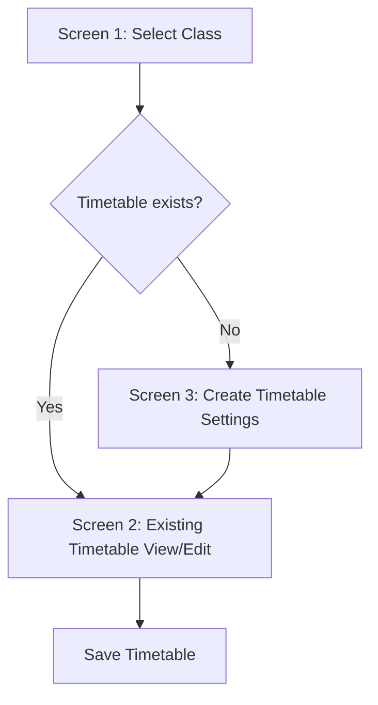

# Principal Timetable Management — Mobile Screen Design

## Goal
Create a simple manual timetable editor for the Principal module. The principal should be able to select a class, view an existing timetable, or create/edit a timetable manually using start time, end time, period duration, gap duration, breaks, and subject dropdowns.

No auto-generation logic is required. The system should only calculate/display period slots based on entered timing settings and allow manual subject selection.

---

## Main Flow



---

# Screen 1 — Select Class

## Purpose
The principal selects a class. After selection, the screen checks whether a timetable already exists for that class.

## Mobile Wireframe

```text
┌──────────────────────────────┐
│ ← Timetable Management       │
│ Select class to continue     │
├──────────────────────────────┤
│ Select Class                 │
│ ┌──────────────────────────┐ │
│ │ Class 7 - A          ▼   │ │
│ └──────────────────────────┘ │
│                              │
│ ┌──────────────────────────┐ │
│ │ Existing Timetable       │ │
│ │ Last updated: 02 Jul     │ │
│ │ Status: Active           │ │
│ │                          │ │
│ │ [View / Edit Timetable]  │ │
│ └──────────────────────────┘ │
│                              │
│ OR                           │
│                              │
│ ┌──────────────────────────┐ │
│ │ No Timetable Found       │ │
│ │ This class does not have │ │
│ │ a timetable yet.         │ │
│ │                          │ │
│ │ [Create Timetable]       │ │
│ └──────────────────────────┘ │
└──────────────────────────────┘
```

## Functional Rules
- Load all active classes.
- On selecting a class, check whether a timetable exists.
- If timetable exists, show existing timetable card.
- If timetable does not exist, show create timetable card.
- Do not show auto-generation options.

---

# Screen 2 — Create Timetable Settings

## Purpose
This screen is shown when the selected class does not have a timetable. The principal enters basic timing settings and break details.

## Mobile Wireframe

```text
┌──────────────────────────────┐
│ ← Create Timetable           │
│ Class 7 - A                  │
├──────────────────────────────┤
│ Basic Timing                 │
│ ┌────────────┐ ┌───────────┐ │
│ │ Start Time │ │ End Time  │ │
│ │ 09:00 AM   │ │ 03:30 PM  │ │
│ └────────────┘ └───────────┘ │
│                              │
│ ┌────────────┐ ┌───────────┐ │
│ │ Period Dur │ │ Gap       │ │
│ │ 45 mins ▼  │ │ 10 mins ▼ │ │
│ └────────────┘ └───────────┘ │
│                              │
│ Breaks                       │
│ ┌──────────────────────────┐ │
│ │ Break Name: Short Break  │ │
│ │ Start: 10:40 AM          │ │
│ │ Duration: 10 mins        │ │
│ │ [Remove]                 │ │
│ └──────────────────────────┘ │
│                              │
│ [+ Add Break]                │
│                              │
│ Working Days                 │
│ [Mon] [Tue] [Wed] [Thu]     │
│ [Fri] [Sat]                 │
│                              │
│ [Create Editable Timetable]  │
└──────────────────────────────┘
```

## Functional Rules
- Required fields:
  - Start time
  - End time
  - Period duration
  - Gap between periods
  - Working days
- Breaks are optional.
- Multiple breaks should be supported.
- After entering settings, the app should create an editable timetable grid.
- The grid should use the class subjects as dropdown options.

---

# Screen 3 — Timetable Editor

## Purpose
This is the main editable timetable screen. It should feel like a mobile-friendly Excel table. Days are rows and periods are columns. Each cell has a subject dropdown.

## Mobile Wireframe

```text
┌──────────────────────────────┐
│ ← Class 7 - A Timetable      │
│ Draft                        │
├──────────────────────────────┤
│ [Reset]      [Preview] [Save]│
├──────────────────────────────┤
│ Swipe horizontally to edit → │
│                              │
│ ┌──────────────────────────┐ │
│ │ Day / Period | P1 | P2   │ │
│ │ Time         |09  |09:55 │ │
│ ├──────────────────────────┤ │
│ │ Monday       |Eng▼|Math▼ │ │
│ │ Tuesday      |Math▼|Eng▼ │ │
│ │ Wednesday    |Sci▼|Math▼ │ │
│ │ Thursday     |Hin▼|Sci▼  │ │
│ │ Friday       |Eng▼|Soc▼  │ │
│ │ Saturday     |Math▼|Hin▼ │ │
│ └──────────────────────────┘ │
│                              │
│ More periods →               │
│                              │
│ ┌──────────────────────────┐ │
│ │ Break: 10:40 - 10:50     │ │
│ │ Lunch: 01:25 - 01:55     │ │
│ └──────────────────────────┘ │
└──────────────────────────────┘
```

## Expanded Table Behaviour

```text
┌────────────┬────────┬────────┬────────┬────────┬────────┐
│ Day/Period │ P1     │ P2     │ Break  │ P3     │ P4     │
│ Time       │ 09:00  │ 09:55  │ 10:40  │ 10:50  │ 11:45  │
├────────────┼────────┼────────┼────────┼────────┼────────┤
│ Monday     │ Eng ▼  │ Math ▼ │ Break  │ Sci ▼  │ Hindi▼ │
│ Tuesday    │ Math▼  │ Eng ▼  │ Break  │ Sci ▼  │ Sans▼  │
│ Wednesday  │ Sci ▼  │ Math▼  │ Break  │ Eng ▼  │ Soc ▼  │
│ Thursday   │ Hindi▼ │ Sci ▼  │ Break  │ Math▼  │ Eng ▼  │
│ Friday     │ Eng ▼  │ Soc ▼  │ Break  │ Sci ▼  │ Math▼  │
│ Saturday   │ Math▼  │ Hindi▼ │ Break  │ Eng ▼  │ Sci ▼  │
└────────────┴────────┴────────┴────────┴────────┴────────┘
```

## Functional Rules
- Subjects should be loaded only from the selected class.
- Each period cell should have:
  - Subject dropdown
  - Optional empty/free period value
- Break and lunch cells should not be editable as subjects.
- Table should support horizontal scrolling on mobile.
- First column with day names should remain sticky if possible.
- Top action buttons:
  - Reset
  - Preview
  - Save

---

# Subject Dropdown Behaviour

```text
┌──────────────────────────────┐
│ Select Subject               │
├──────────────────────────────┤
│ Subject1                     │
│ Subject2                     │
│ Subject3                     │
│ Subject4                     │
│ Break 1                      │
│ Subject5                     │
│ Subject6.                    |
| Break 2                      │
└──────────────────────────────┘
```
Brakes names can be changable
## Rules
- Dropdown options come from the selected class subjects.
- Include `Free Period` option.
- Breaks should not appear as subjects.

---

# Save / Preview Screen

## Purpose
Before final saving, the principal can review the timetable in read-only mode.

## Mobile Wireframe

```text
┌──────────────────────────────┐
│ ← Timetable Preview          │
│ Class 7 - A                  │
├──────────────────────────────┤
│ [Edit]        [Save Timetable]│
├──────────────────────────────┤
│ Swipe horizontally →         │
│                              │
│ ┌──────────────────────────┐ │
│ │ Day / Period | P1 | P2   │ │
│ │ Monday       |Eng |Math  │ │
│ │ Tuesday      |Math|Eng   │ │
│ │ Wednesday    |Sci |Math  │ │
│ └──────────────────────────┘ │
│                              │
│ Summary                      │
│ Class: Class 7 - A           │
│ Working days: Mon - Sat      │
│ Total periods/day: 8         │
│ Breaks: 2                    │
│ Status: Ready to Save        │
└──────────────────────────────┘
```

## Rules
- Preview table is read-only.
- Edit button returns to timetable editor.
- Save Timetable stores the timetable and marks it active.

---

# Data Requirements

## Required Data

```text
Class
- class_id
- class_name
- section
- status

Subject
- subject_id
- class_id
- subject_name
- subject_code
- status

Timetable
- timetable_id
- class_id
- start_time
- end_time
- period_duration_minutes
- gap_duration_minutes
- working_days
- status

TimetableBreak
- break_id
- timetable_id
- break_name
- start_time
- duration_minutes

TimetableCell
- cell_id
- timetable_id
- day
- period_number
- start_time
- end_time
- subject_id
- cell_type: period / break / lunch / free
```

---

# Developer Notes

## Recommended Implementation
- Keep timetable creation manual.
- Generate only the empty period slots from start time, end time, duration, gap, and breaks.
- Do not auto-assign subjects.
- Principal manually selects subjects for each cell.
- Store each cell separately so editing is easy.

## Mobile UX Notes
- Use cards for settings screens.
- Use horizontal scroll for the timetable table.
- Keep day column sticky if possible.
- Use clear labels for break and lunch columns.
- Save draft locally or in backend before final save if possible.

---

# Final Screen Flow Summary

```text
Screen 1: Select Class
        ↓
If timetable exists → View/Edit Timetable
        ↓
If timetable does not exist → Create Timetable Settings
        ↓
Editable Excel-like Timetable
        ↓
Preview
        ↓
Save Timetable
```
