# SchoolDesk Database ERD — Visual Diagrams

> **Format:** Mermaid ERD (renders natively in GitHub, GitLab, Notion, Obsidian, etc.)
> **Tables:** 60+  |  **Relationships:** Foundation → Staff/Auth → Students → Operations

---

## How to View

1. **GitHub/GitLab:** The diagrams render automatically
2. **VS Code:** Install the *Markdown Preview Mermaid Support* extension
3. **Browser:** Use the [Mermaid Live Editor](https://mermaid.live/)
4. **CLI:** Use `npx @mermaid-js/mermaid-cli` to export PNG/SVG

---

## Layer 1: Foundation & School Configuration

```mermaid
erDiagram
    schools ||--o{ academic_years : "has"
    schools ||--o{ roles : "defines"
    schools ||--o{ subjects : "teaches"
    schools ||--o{ grades : "has"
    schools ||--o{ departments : "organizes"
    schools ||--o{ rooms : "contains"
    schools ||--o{ holidays : "observes"
    schools ||--o{ working_day_configs : "configures"

    academic_years ||--o{ terms : "divided_into"

    grades ||--o{ sections : "contains"
    grades ||--o{ grade_subjects : "has"
    grades ||--o{ fee_structures : "assigned"
    grades ||--o{ exam_schedules : "scheduled"

    subjects ||--o{ grade_subjects : "assigned_to"
    subjects ||--o{ staff_subjects : "taught_by"
    subjects ||--o{ timetable_slots : "scheduled"
    subjects ||--o{ homework : "given"
    subjects ||--o{ exam_schedules : "examined"

    roles ||--o{ permissions : "grants"
    roles ||--o{ users : "assigned_to"

    academic_years ||--o{ enrollments : "tracks"
    academic_years ||--o{ timetable_slots : "planned"
    academic_years ||--o{ exams : "scheduled"
    academic_years ||--o{ leave_balances : "allocated"

    sections ||--o{ enrollments : "enrolls"
    sections ||--o{ timetable_slots : "has"
    sections ||--o{ attendance : "records"
    sections ||--o{ homework : "assigned"
    sections ||--o{ exam_schedules : "scheduled"
    sections ||--o{ diary_entries : "logs"
    sections ||--o{ staff_subjects : "assigned"

    departments ||--o{ staffs : "employs"

    terms ||--o{ timetable_slots : "scheduled_in"
    terms ||--o{ exams : "conducted_in"

    rooms ||--o{ timetable_slots : "houses"
    rooms ||--o{ exam_schedules : "assigned"

    fee_categories ||--o{ fee_structures : "categorized"
    fee_categories ||--o{ fees : "typed"
    fee_categories ||--o{ concessions : "applies_to"

    leave_types ||--o{ leaves : "typed"
    leave_types ||--o{ leave_balances : "tracks"

    transport_routes ||--o{ transport_stops : "has"
    transport_routes ||--o{ student_transport_mappings : "used_by"

    schools ||--o{ frontend_records : "stores_dynamic_data"


    schools {
        string id PK "UUID"
        string school_name "School name"
        string school_code UK "Unique code"
        string address
        string city
        string state
        string country "Default: India"
        string phone
        string email
        string website
        string logo_url
        string affiliation_number
        string academic_year_id FK "Current active year"
        bool is_active "Default: true"
        datetime created_at
        datetime updated_at
    }

    academic_years {
        string id PK "UUID"
        string school_id FK "NOT NULL"
        string year_name "e.g. 2025-2026"
        date start_date "NOT NULL"
        date end_date "NOT NULL"
        bool is_current "Default: false"
        datetime created_at
        datetime updated_at
    }

    terms {
        string id PK "UUID"
        string academic_year_id FK "NOT NULL"
        string term_name "e.g. Term 1"
        date start_date "NOT NULL"
        date end_date "NOT NULL"
        bool is_current "Default: false"
        datetime created_at
        datetime updated_at
    }

    roles {
        string id PK "UUID"
        string school_id FK "NOT NULL"
        string role_name "Admin|Teacher|Parent|Principal|..."
        string description
        int priority "Default: 0"
        bool is_system_role "Default: false"
        datetime created_at
        datetime updated_at
    }

    permissions {
        string id PK "UUID"
        string role_id FK "NOT NULL"
        string module "NOT NULL"
        bool can_view "Default: false"
        bool can_create "Default: false"
        bool can_edit "Default: false"
        bool can_delete "Default: false"
        bool can_approve "Default: false"
        datetime created_at
    }

    subjects {
        string id PK "UUID"
        string school_id FK "NOT NULL"
        string subject_name "NOT NULL"
        string subject_code
        string subject_type "core|elective|language"
        bool is_mandatory "Default: true"
        datetime created_at
        datetime updated_at
    }

    grades {
        string id PK "UUID"
        string school_id FK "NOT NULL"
        string grade_name "e.g. Grade 10"
        string grade_code
        string next_grade_id FK "Self-ref"
        datetime created_at
        datetime updated_at
    }

    grade_subjects {
        string id PK "UUID"
        string grade_id FK "NOT NULL"
        string subject_id FK "NOT NULL"
        bool is_mandatory "Default: true"
        int periods_per_week "Default: 1"
        int max_marks "Default: 100"
        int pass_marks "Default: 35"
    }

    sections {
        string id PK "UUID"
        string grade_id FK "NOT NULL"
        string section_name "e.g. A, B"
        int capacity
        string class_teacher_id FK "staffs"
        string academic_year_id FK
        datetime created_at
        datetime updated_at
    }

    departments {
        string id PK "UUID"
        string school_id FK "NOT NULL"
        string department_name "NOT NULL"
        string description
        string head_staff_id FK "staffs"
    }

    rooms {
        string id PK "UUID"
        string school_id FK "NOT NULL"
        string room_name "e.g. Room 101"
        int capacity
        string room_type "classroom|lab|library|office"
        string building
        int floor
    }

    holidays {
        string id PK "UUID"
        string school_id FK "NOT NULL"
        string holiday_name "NOT NULL"
        date holiday_date "NOT NULL"
        bool is_recurring "Default: false"
        string holiday_type "national|festival|event"
    }

    working_day_configs {
        string id PK "UUID"
        string school_id FK "NOT NULL"
        int day_of_week "1=Mon..7=Sun"
        bool is_working_day "Default: true"
        string start_time
        string end_time
    }
```

---

## Layer 2: Staff, Users & Authentication

```mermaid
erDiagram
    schools ||--o{ staffs : "employs"
    schools ||--o{ users : "has_accounts"

    staffs ||--o{ staff_qualifications : "has"
    staffs ||--o{ staff_subjects : "teaches"
    staffs ||--o{ staff_documents : "uploads"
    staffs ||--o{ leave_balances : "allocated"
    staffs ||--o{ staff_attendances : "recorded"
    staffs ||--o{ leaves : "requests"
    staffs ||--o{ parent_teacher_meetings : "scheduled"

    staffs ||--o{ timetable_slots : "instructs"
    staffs ||--o{ substitutions_original : "substituted"
    staffs ||--o{ substitutions_substitute : "substitutes"
    staffs ||--o{ homework : "assigns"
    staffs ||--o{ diary_entries : "creates"

    sections ||--o{ class_teacher : "leads"
    sections ||--o{ staff_subjects : "assigned"

    departments ||--o{ staffs : "belongs_to"

    users ||--o{ user_sessions : "has"
    users ||--o{ otp_verifications : "requests"
    users ||--o{ audit_logs : "performs"
    users ||--o{ device_tokens : "registers"
    users ||--o{ notifications : "receives"
    users ||--o{ parent_student_links_parent : "links_as_parent"
    users ||--o{ parent_teacher_meetings : "books"

    roles ||--o{ users : "assigned_to"

    staffs ||--o{ users_linked_staff : "linked_as" : "linked_type=staff"


    staffs {
        string id PK "UUID"
        string school_id FK "NOT NULL"
        string staff_code UK "Unique per school"
        string first_name "NOT NULL"
        string last_name
        string email
        string phone
        date date_of_birth
        string gender
        string designation
        string employment_type "permanent|contract|temporary"
        string department_id FK
        date join_date
        decimal basic_salary
        string status "active|inactive|pending_approval"
        datetime created_at
        datetime updated_at
    }

    staff_qualifications {
        string id PK "UUID"
        string staff_id FK "NOT NULL"
        string qualification_name "NOT NULL"
        string institution
        int year_completed
        string grade_or_percentage
    }

    staff_subjects {
        string id PK "UUID"
        string staff_id FK "NOT NULL"
        string subject_id FK "NOT NULL"
        string grade_id FK
        string section_id FK
        bool is_primary "Default: false"
    }

    staff_documents {
        string id PK "UUID"
        string staff_id FK "NOT NULL"
        string doc_type "profile_photo|certificate|id_proof"
        string file_url "NOT NULL"
        bool verified "Default: false"
        datetime uploaded_at
        datetime updated_at
    }

    users {
        string id PK "UUID"
        string school_id FK "NOT NULL"
        string name "NOT NULL"
        string username UK "Unique per school"
        string email
        string phone
        string password_hash "NOT NULL - bcrypt"
        string role_id FK "NOT NULL"
        string role_slug
        string linked_type "staff|parent"
        string linked_id "Polymorphic FK"
        string avatar
        bool is_active "Default: true"
        bool is_verified "Default: false"
        datetime last_login
        datetime last_password_change
        bool two_factor_enabled "Default: false"
        datetime created_at
        datetime updated_at
    }

    user_sessions {
        string id PK "UUID"
        string user_id FK "NOT NULL"
        string refresh_token "NOT NULL"
        string device_info
        string ip_address
        datetime expires_at "NOT NULL"
        bool is_revoked "Default: false"
        datetime created_at
    }

    otp_verifications {
        string id PK "UUID"
        string user_id FK
        string email
        string phone
        string otp_code "NOT NULL"
        string purpose "password_reset|email_verify|login"
        datetime expires_at "NOT NULL"
        bool is_used "Default: false"
        int attempts "Default: 0"
    }

    audit_logs {
        string id PK "UUID"
        string school_id FK
        string user_id FK
        string action "NOT NULL"
        string entity_type "NOT NULL"
        string entity_id
        json old_values
        json new_values
        string ip_address
        string user_agent
        datetime created_at
    }

    device_tokens {
        string id PK "UUID"
        string user_id FK "NOT NULL"
        string device_token "NOT NULL"
        string platform "android|ios|web"
        bool is_active "Default: true"
        datetime created_at
    }
```

---

## Layer 3: Students & Enrollments

```mermaid
erDiagram
    schools ||--o{ students : "enrolls"
    students ||--o{ guardians : "has"
    students ||--o{ medical_records : "tracks"
    students ||--o{ student_documents : "uploads"
    students ||--o{ enrollments : "enrolled_in"
    students ||--o{ transfer_records : "transferred"
    students ||--o{ parent_student_links_student : "linked_to_parents"
    students ||--o{ attendance : "marked"
    students ||--o{ student_leaves : "requests"
    students ||--o{ fees : "pays"
    students ||--o{ concessions : "applies_for"
    students ||--o{ student_marks : "scores"
    students ||--o{ report_cards : "receives"
    students ||--o{ homework_submissions : "submits"
    students ||--o{ library_transactions : "borrows"
    students ||--o{ student_transport_mappings : "rides"
    students ||--o{ parent_teacher_meetings : "discussed"

    enrollments ||--o{ student_marks : "tracks"


    students {
        string id PK "UUID"
        string school_id FK "NOT NULL"
        string admission_no UK "Unique per school"
        string roll_number
        string first_name "NOT NULL"
        string last_name
        date date_of_birth
        string gender
        string blood_group
        string email
        string phone
        string address
        string city
        string state
        string pincode
        string profile_photo_url
        string status "active|inactive"
        date admission_date
        datetime created_at
        datetime updated_at
    }

    guardians {
        string id PK "UUID"
        string student_id FK "NOT NULL"
        string guardian_name "NOT NULL"
        string relationship "father|mother|guardian"
        string phone
        string email
        string occupation
        decimal income
        string address
        bool is_primary_contact "Default: true"
    }

    medical_records {
        string id PK "UUID"
        string student_id FK "NOT NULL"
        string blood_group
        string allergies
        string medical_conditions
        string emergency_contact
        string blood_group_check "Duplicate of blood_group in model"
        datetime updated_at
    }

    student_documents {
        string id PK "UUID"
        string student_id FK "NOT NULL"
        string doc_type "profile_photo|birth_certificate|..."
        string file_url "NOT NULL"
        bool verified "Default: false"
        datetime uploaded_at
        datetime updated_at
    }

    enrollments {
        string id PK "UUID"
        string student_id FK "NOT NULL"
        string section_id FK "NOT NULL"
        string academic_year_id FK "NOT NULL"
        string roll_number
        date enrollment_date
        string status "active"
        datetime created_at
        datetime updated_at
    }

    parent_student_links {
        string id PK "UUID"
        string parent_user_id FK "NOT NULL - users"
        string student_id FK "NOT NULL - students"
        string relationship
        bool is_primary "Default: false"
        datetime created_at
    }

    transfer_records {
        string id PK "UUID"
        string student_id FK "NOT NULL"
        string from_school_id FK "schools"
        string to_school_id FK "schools"
        date transfer_date
        string reason
        string tc_document_url
        datetime created_at
    }

    promotion_rules {
        string id PK "UUID"
        string school_id FK
        string from_grade_id FK "grades"
        string to_grade_id FK "grades"
        decimal min_percentage
        string criteria
        bool auto_promote "Default: false"
        datetime created_at
    }
```

---

## Layer 4: Academics & Operations

### 4.1 Attendance

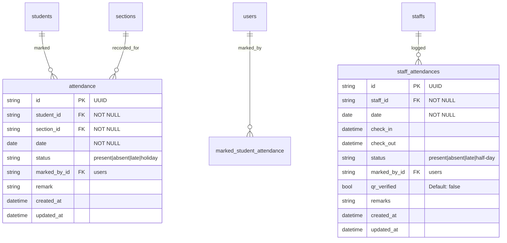

### 4.2 Timetable & Substitutions

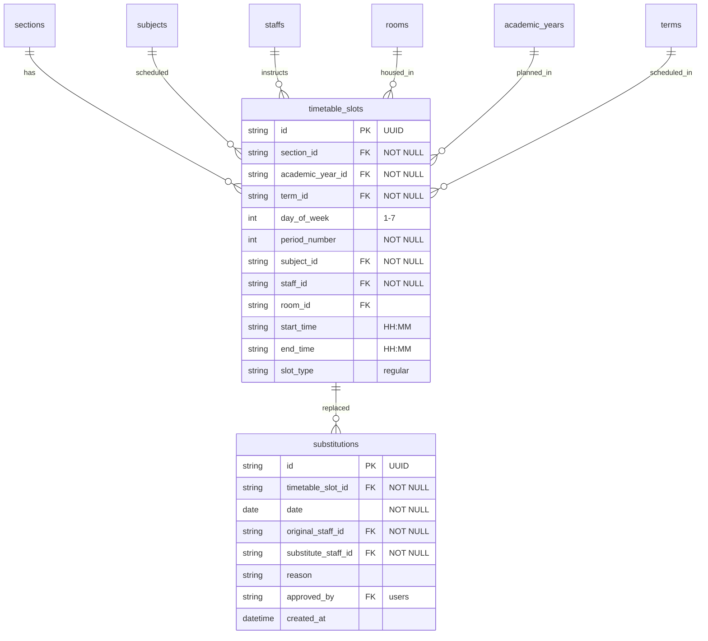

### 4.3 Fees & Finance

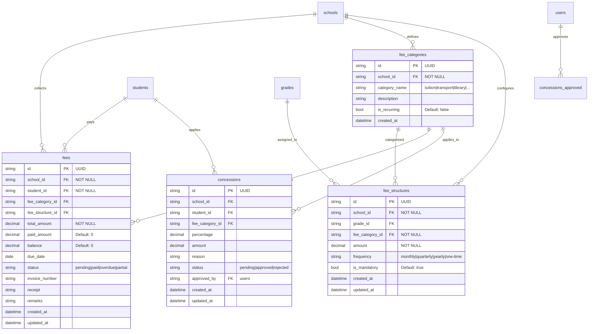

### 4.4 Exams, Marks & Results

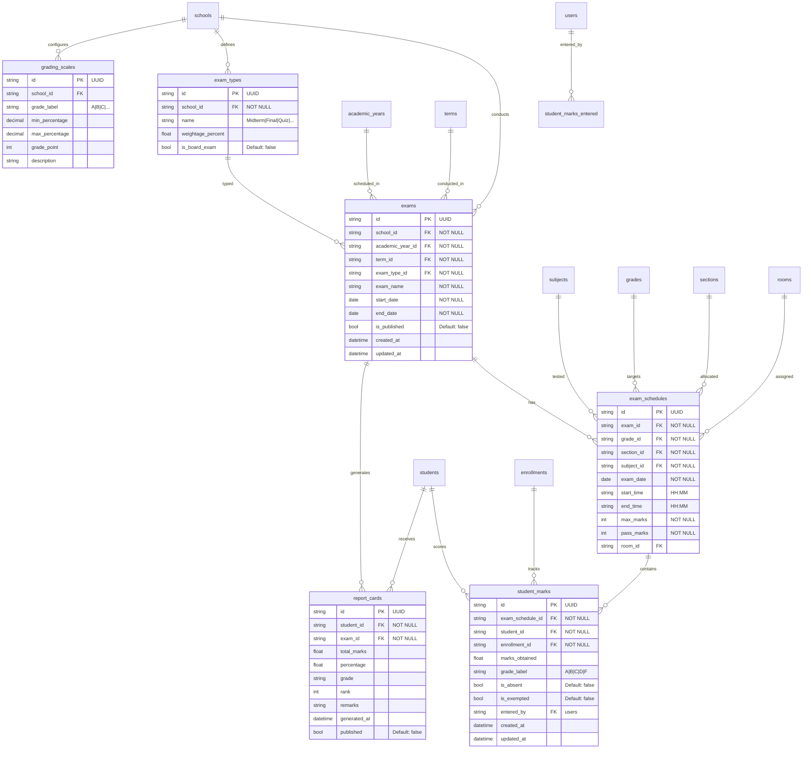

### 4.5 Homework & Diary

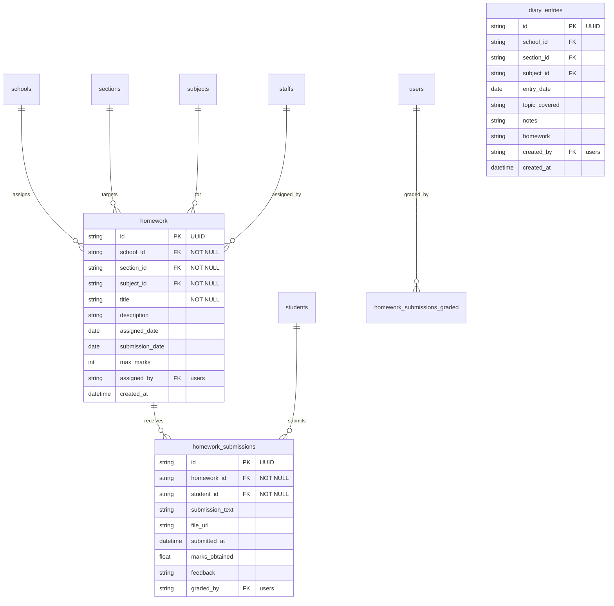

### 4.6 Leaves

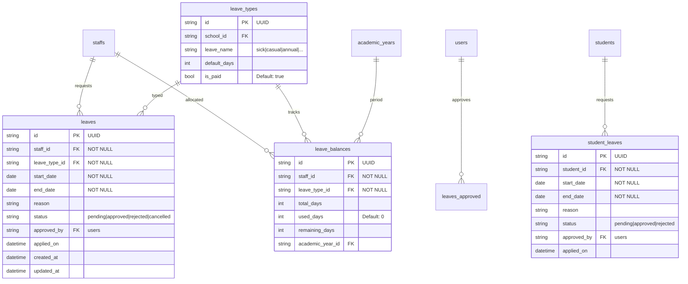

### 4.7 Communications & Notifications

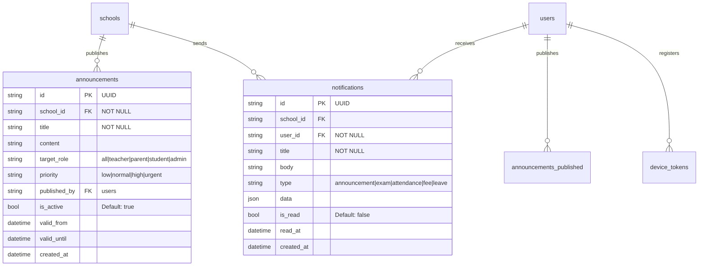

### 4.8 Parent-Teacher Meetings

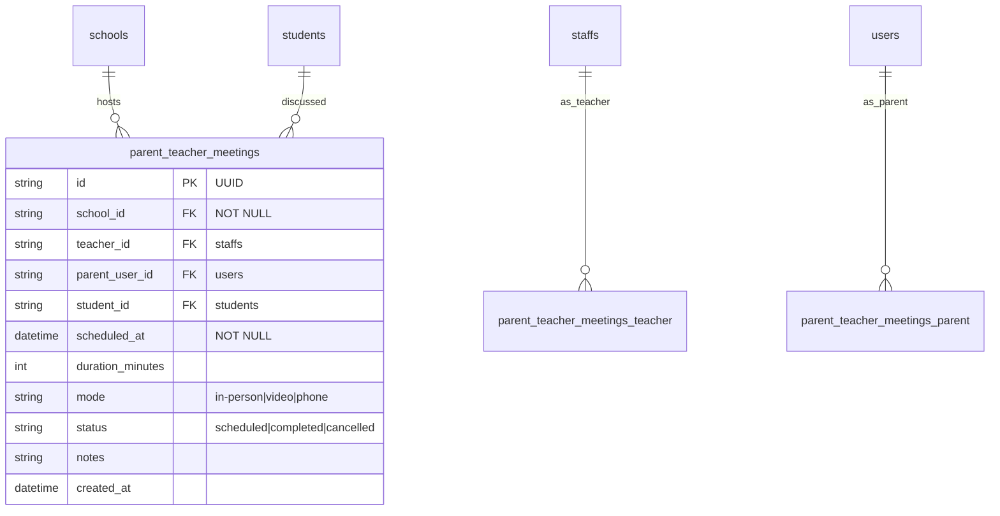

### 4.9 Library & Transport

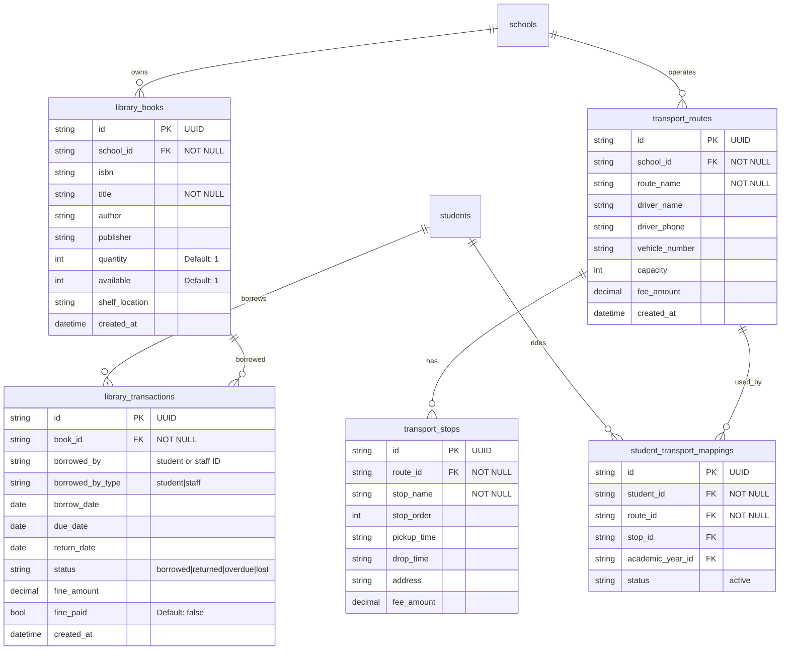

---

## Full Database Schema Overview

This diagram shows the high-level relationships between all major domain groups:

```mermaid
graph TB
    subgraph Foundation["Foundation & Config (14 tables)"]
        S[schools]
        AY[academic_years]
        TE[terms]
        GR[grades]
        SU[subjects]
        GS[grade_subjects]
        SE[sections]
        RO[roles]
        PE[permissions]
        DE[departments]
        RM[rooms]
        HD[holidays]
        WD[working_day_configs]
        FC[fee_categories]
        LT[leave_types]
        FR[frontend_records]
    end

    subgraph StaffAuth["Staff & Auth (10 tables)"]
        ST[staffs]
        SQ[staff_qualifications]
        SS[staff_subjects]
        SD[staff_documents]
        LB[leave_balances]
        US[users]
        USR[user_sessions]
        OTP[otp_verifications]
        AL[audit_logs]
        DT[device_tokens]
    end

    subgraph Students["Students (8 tables)"]
        STD[students]
        GU[guardians]
        MR[medical_records]
        SDO[student_documents]
        EN[enrollments]
        PSL[parent_student_links]
        TX[transfer_records]
        PR[promotion_rules]
    end

    subgraph Operations["Operations (25+ tables)"]
        AT[attendance]
        SA[staff_attendances]
        TS2[timetable_slots]
        SUB[substitutions]
        FE[fees]
        FS[fee_structures]
        CO[concessions]
        EX[exams]
        ET[exam_types]
        ES[exam_schedules]
        SM[student_marks]
        RC[report_cards]
        GS2[grading_scales]
        HW[homework]
        HWS[homework_submissions]
        DI[diary_entries]
        LV[leaves]
        SL[student_leaves]
        AN[announcements]
        NO[notifications]
        PTM[parent_teacher_meetings]
        LB2[library_books]
        LT2[library_transactions]
        TR[transport_routes]
        TS[transport_stops]
        STM[student_transport_mappings]
    end

    S --> AY & RO & SU & GR & DE & RM & HD & WD & ST & STD & FE & EX & AN & TR & FC & FR
    GR --> SE & GS
    SU --> GS & SS & TS2 & HW & ES
    SE --> EN & TS2 & AT & HW & ES & DI & SS
    AY --> TE & EN & TS2 & EX & LB
    RO --> PE & US
    US --> USR & OTP & AL & DT & NO & AN
    ST --> SQ & SS & SD & LB & SA & LV & TS2 & PTM
    STD --> GU & MR & SDO & EN & PSL & TX & AT & SL & FE & SM & RC & HWS & LT2 & STM & PTM
    EN --> SM
    EX --> ES & RC
    ES --> SM
    TS2 --> SUB
    FE --> FS & FC & CO
    LV --> LT
    TR --> TS & STM
    LB2 --> LT2

    style Foundation fill:#e1f5fe,stroke:#0288d1
    style StaffAuth fill:#f3e5f5,stroke:#7b1fa2
    style Students fill:#e8f5e9,stroke:#388e3c
    style Operations fill:#fff3e0,stroke:#f57c00
```

### 4.10 Dynamic Data Store

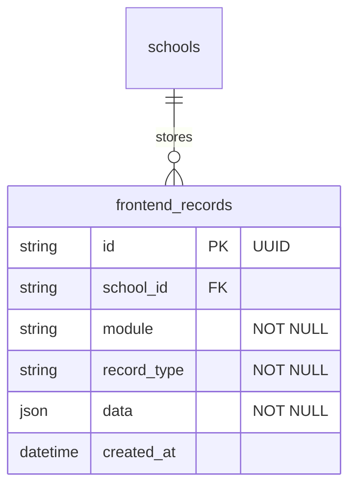

---

| Symbol | Meaning |
|--------|---------|
| `||--o{` | One-to-many relationship |
| `||--||` | One-to-one relationship |
| `}o--o{` | Many-to-many relationship |
| **PK** | Primary Key |
| **FK** | Foreign Key |
| **UK** | Unique Key |

---

*Generated from SchoolDesk backend source code (`school-backend/`). For detailed column-level documentation, see `BACKEND_DOCUMENTATION.md`.*
